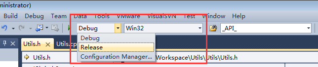
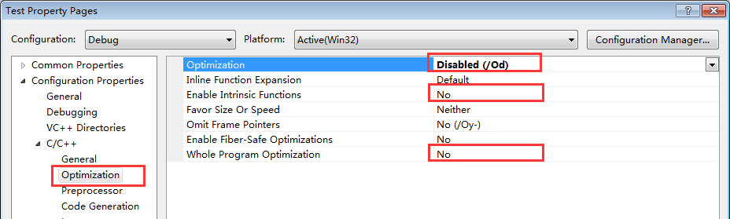
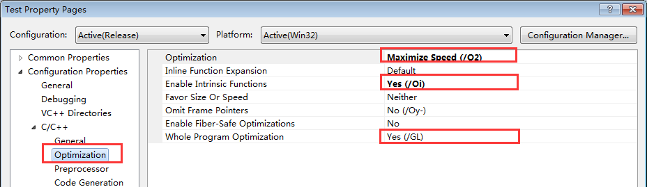
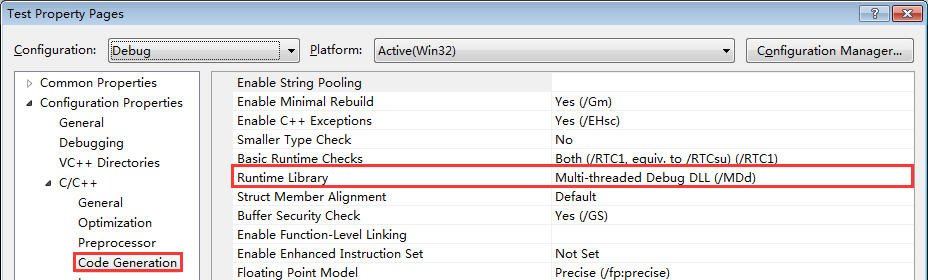
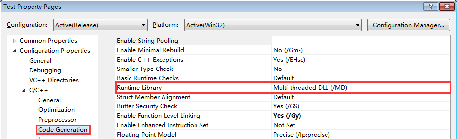
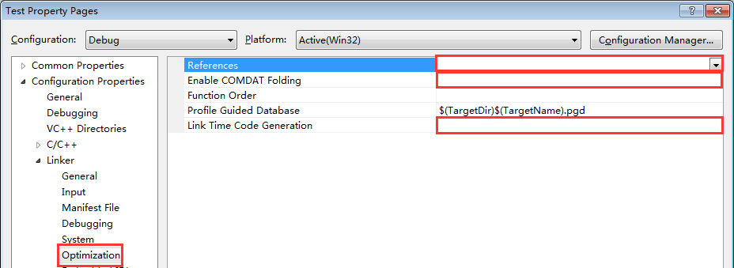
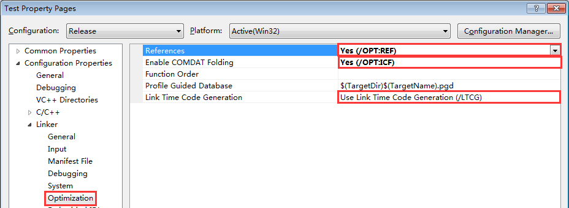
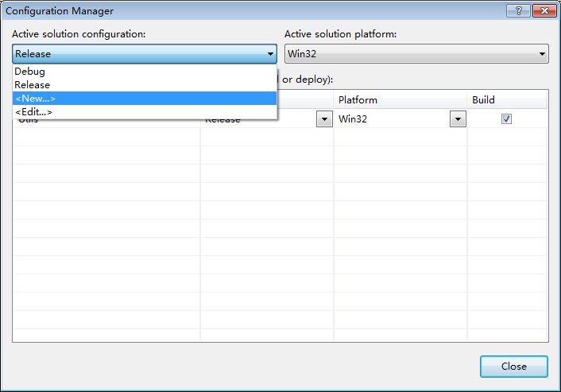
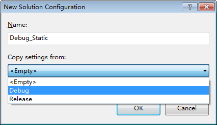
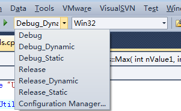

# 带你玩转Visual Studio——带你管理多种释出版本

上一篇文章[带你玩转Visual Studio——带你发布自己的工程库]( http://blog.csdn.net/luoweifu/article/details/48895765)让我们了解基本的静态库和动态库，并将自己的工程编译成库，也能在自己的工程中引入第三方库。正如上文提到的，我们在实际开发中可能会将工程释出(也叫发布)多个不同类型的版本，如即要有静态库也要有动态库，即有 Debug 也有 Release 。如何管理这些不同的释出版本就是本文要讲的内容。

## 为什么要有多种释出版本

我们每打开一个工程你都会在工具栏中看到有 Debug 和 Release 两个编译方式的选择。它们有什么区别，又为什么要有 Debug 和 Release 呢？

 

### Debug

 Debug 通常称为调试版本，它包含调试信息，并且不作任何优化，便于程序员调试程序。

### Release

Release 称为发布版本，它往往是进行了各种优化，使得程序在代码大小和运行速度上都是最优的，以使编译出的可执行文件或库的性能最高，以便用户很好地使用。

### Debug 与 Release 的区别

Debug 和 Release 本质上就是两组不同的编译选择配制，各自的默认设置一般不用更改。它们最大的区别在于 Release 进行了优化，去掉了调试信息，因此 Release 常用无法进行正确的调试；而 Debug 没有进行优化，包含了调试信息，以方便程序员进行调试。我们可以通过比较它们的配制发现它们之间的区别：

1. 代码编译的优化 

Debug 

Release

2. 使用的运行时库

Debug 

Release

Debug使用的运行时库一般后面会加 d，而 Release 的不加，关于运行时库的问题后面还会有专门章节的进行讲解。
 
3. 链接的优化 

Debug 

Release

## 释出方式的配制和管理

既然 Debug 或 Release 就一组配制，那能不能息增加一组配制呢？当然是可以的。还记得上一文[带你发布自己的工程库](http://blog.csdn.net/luoweifu/article/details/48895765)中的例子 Utils 吗？既要编译静态库又要编译动态库，我们之前都是在 Debug 下配制的，但编译静态库与动态库切换时每次都要更改配制非常麻烦，其实我们只要为静态库与动态库添加两组两组机制，每次编译时切换一下编译项就可以了。

1. 点击上面图1下拉列表框的 Configuration Manager… 或右键工程->属性->右上角的 Configuration Manager…。打开 Configuration Manager 对话框。

2. 在 Active solution configuration 下拉列表中点击 New 新建的一组配制。 

Configuration Manager

3. Copy settings from 里有几个选择，Empty表示不拷贝任何配制，添加一组默认设置的配制项；Debug 表示会拷贝已有的 Debug 这组配制中的所有设置，添加完后你再基于这个配制进行修改。一般我们会从已有的 Debug 或 Release 中拷贝然后再进行相应的修改，因为 Debug 或 Release 中有很多已经设置好的配制，这样不容易出错，而且Debug 或 Release 也是默认的标准配制。 

4. 选择我们新添加的配制项 Debug_static，右键工程->Properties 进行相应的设置，这个在前面一文中已经讲过了，不再赘述。

5. 同样的方式，我们可以增加 Debug_dynamic、Release_Static、Release_Dynamic 等配制项。

 

新增多个配制项