# 带你玩转 Visual Studio——带你多工程开发

上一篇文章[带你玩转 Visual Studio ——带你管理多种释出版本](http://blog.csdn.net/luoweifu/article/details/48912241)让我们了解了 Debug 与 Release 的区别，并学会也如果管理 多个不同释出版本的配制项。在一个大型的项目中，往往不止一个工程，而会有多个工程相互关联，每个工程也都会有自己的释出版本，这就是这篇文章将要讲述的内容。

## 一个 Solution 多个 Project

### 多个工程简介

在[带你玩转 Visual Studio——带你新建一个工程](http://blog.csdn.net/luoweifu/article/details/48692267)一文中提到一个 Solution (解决方案)可以有多个 Project (工程)，那什么时候需要有多工程呢？ 多工程又有什么好处呢？

**应用场景**：当一个项目由多个不同的组件(模块)构成时，为每一个组件创建一个工程，所有的组件工程在同一个解决方案下。 
**优点**：结构清晰，可进行分模块开发，对复杂程序进行解耦。

### 创建一个多工程项目

我们还是以 Utils 这个工程为例，在[带你发布自己的工程库](http://blog.csdn.net/luoweifu/article/details/48895765)一文及上一篇[带你管理多种释出版本](http://blog.csdn.net/luoweifu/article/details/48912241)中已经创建了一个 Utils 工程，并为它编译出了多个版本的库，但我们使用这个库的时候却是在另一个 Solution 下进行的，其实我们完全可以而且也应该把使用 Utils 库的工程与 Utils 工程放在一个解决方案下。

1. **新建 Project 添加到已有 Solution 中**，File->New->Project… 打开新建工程对话框新建一个 UsingUtils 工程，注意在 Solution 这一栏中我们选择 Add to solution。 

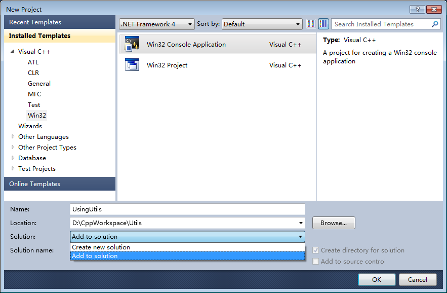

2. **添加引用关联**，这时我们要使用这个 Utils 编译出来的库，配制也要简单一点了。右键 UsingUtils 工程->Properties->Common Properties->Framework and references，添加引用(依赖)的工程 Utils。设置引用关联后，如果 Utils 工程发生改动或更新，在编译 UsingUtils 工程时就会重新编译 Utils 工程。 
 
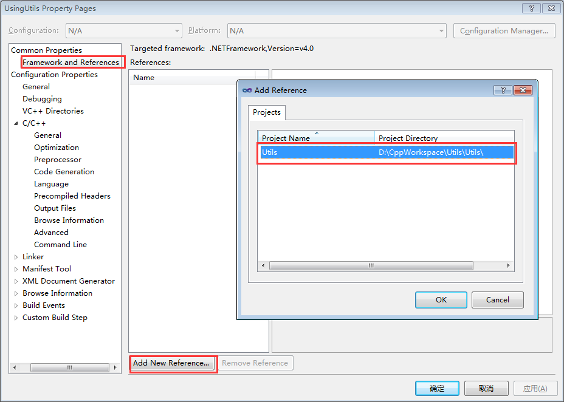
添加引用关联

3. **设置头文件的路径**。

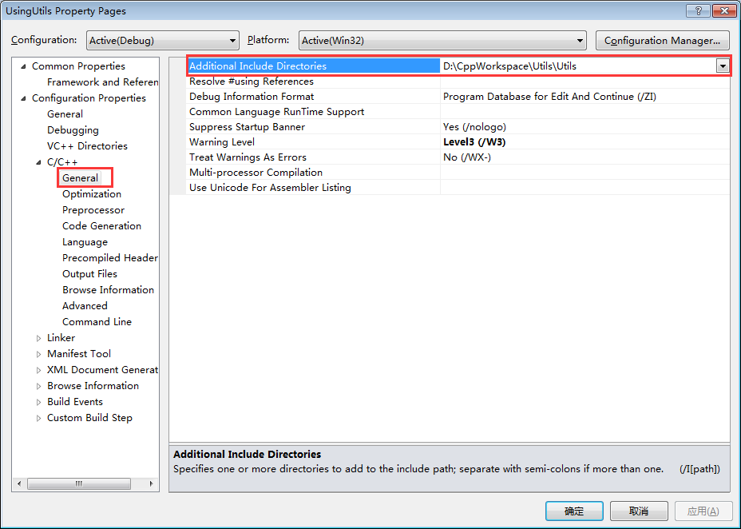设置头文件的路径

4. **设置启动工程**，在有多个工程的 Solution 中要设置启动工程(也就是要第一个开始执行的工程)，不然你按 F5 运行时不知道从哪个工程开始执行。选择 UsingUtils 工程名右键鼠标->Set as Startup  Project 。然后就可以执行或调试 UsingUtils 工程了。 

## 编译结果和目录管理

在多个组件同时开发时，把相关的 Project 放在同一个 Solution 下会方便很多。但你有没有发现一个新的问题，如果一个 Solution 有很多的 Project，每一个 Project 目录下都会有一个编译结果的目录，如下图这样你昏不昏？

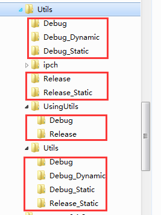 

编译结果目录

那如何管理这些目录，使这些目录看起来不这么混乱呢？其实我们是可以设置这些目录的输出路径的，可以把它们放在一起管理。我们可以将输出目录设计成这样：

- Utils 
 -    Utils
 - UsingUtils
 - Output 
    - Win32 
      - Debug 
       - Bin
       - Lib
       - Temp
     - Release 
       - Bin
       - Lib
       - Temp
    - Linux 
     - Debug 
       - Bin
       - Lib
       - Temp
     - Release 
       - Bin
       - Lib
       - Temp

这样看起来是不是结构清晰多了！Output 为输出目录，Win32 为 Windows X32 下编译的结构，Linux 为 Linux 平台下的编译结果(这个涉及到跨平台开发，暂时不谈)， Win32 下再有 Debug 和 Release 等多个不同的释出版本， Bin 下放置编译出的最终结果(如.exe 等)， Lib 下放置编译出的所有.lib 文件， Temp 放置编译过程的临时文件(如.obj 等)。

我们还是以 Utils 为例进行说明。Utils Solution 下有两个 Project：Utils (编译出 Utils 工具库)和 UsingUtils (使用 Utils 的库)，仅以释出 Debug_Static 进行说明，其它的释出方式与此类似。

1. **所有 Project 使用同一组配制项。** 
什么意思呢？我们在[带你玩转 Visual Studio——带你管理多种释出版本](http://blog.csdn.net/luoweifu/article/details/48912241)一文说到 Debug 和 Release 就是一组配制项，其实整个 Solution 有一个配制项，每一个 Project 也有自己的配制项。 
整个 Solution 的配制项也就是下图工具栏中你能看到的这些配制项： 

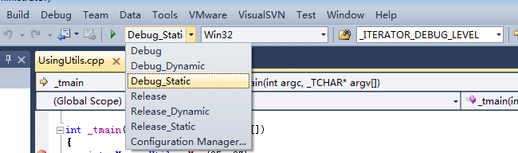
Solution 的配制项

而每一个 Project 的配制荐是你右键工程名 ->Properties 能看到的配制项： 
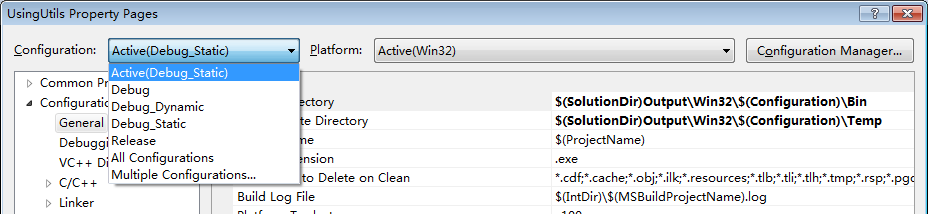

一般一个 Solution 下的所有的 Project 最好使用同组配制项，这样不容易混乱。

2. **给 UsingUtils 添加 Debug_Static 配制项**。我们设置 Utils 的属性时已经配制了 Debug_Static 的配制项，并设置了 Solution 的 Debug_Static 配制项，再给 UsingUtils 添加 Debug_Static 的配制项。 

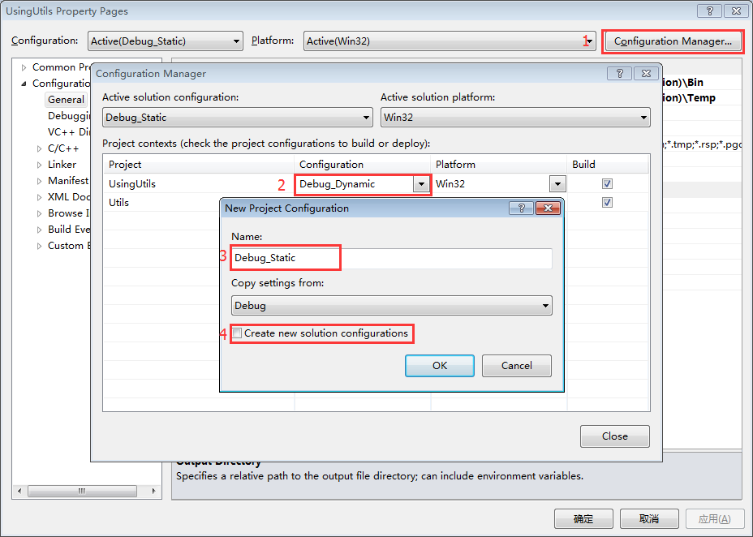
添加配制项

标“4”的 Create new solution configurations 表示为整个 Solution 也添加 (Debug_Static)配制项，这个复选框得取消勾选，因为设置 Utils 时已经为 Solution 默认添加了 Debug_Static 配制项，不然会添加不上。

3. **设置 Utils 的输出路径**，右键 Utils 工程->Properties 进行如下配制。 
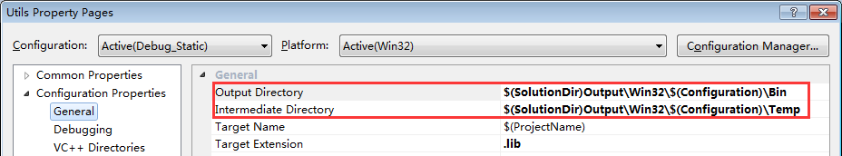

4. 拷贝导出库.lib，我们可以将 Utils 编译出的静态库拷贝 Utils.lib 到 Lib 目录下，这样我们就可以直接把这个文件提供到调用方使用。  

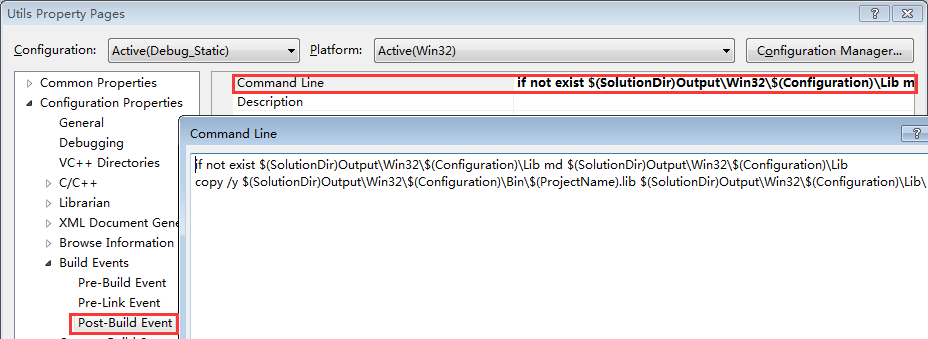

Build Events 中可以设置编译前、链接前、编译后要进行的处理事件。这里我们目地是编译后将编译出的 Utils.lib 拷贝到 Lib 文件夹下，所以我们在 Post-Build Event 输入以下命令

```
:如果 Lib 目录不存在，侧创建这个目录
if not exist $(SolutionDir)Output\Win32\$(Configuration)\Lib md $(SolutionDir)Output\Win32\$(Configuration)\Lib
:将(ProjectName).lib 文件拷贝到 Lib 目录下
copy /y $(SolutionDir)Output\Win32\$(Configuration)\Bin\$(ProjectName).lib $(SolutionDir)Output\Win32\$(Configuration)\Lib\
```

1. **设置 UsingUtils 的输出路径**，与 Utils 类似如下： 

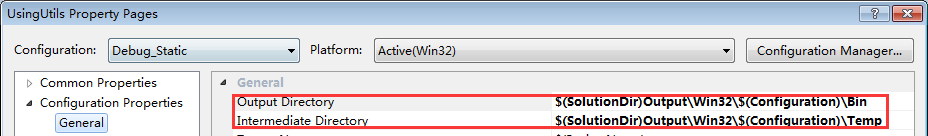

2. **设置完成**，Ok，编译一下再来看看输出结果目录，是不是清晰多了！ 

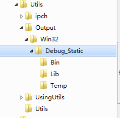
新的输出结果目录