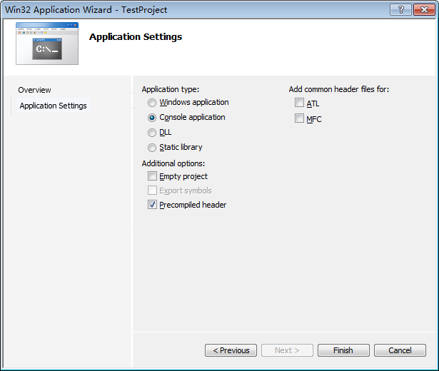
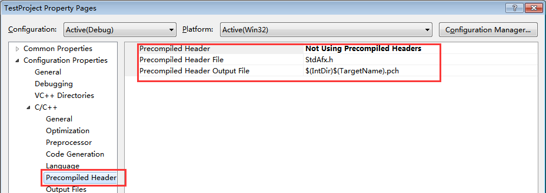
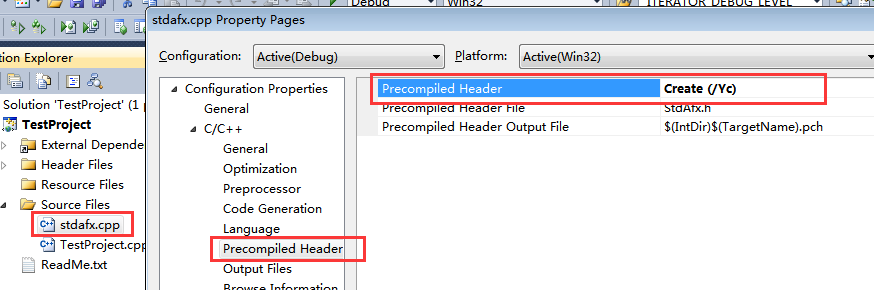

# 带你玩转 Visual Studio——带你理解微软的预编译头技术

通过上一篇文章[带你玩转 Visual Studio ——带你多工程开发](http://blog.csdn.net/luoweifu/article/details/48915347)的讲解，我们能够在一个 Solution 中创建多个 Project ，统一管理一个项目的多个 Project 。本篇文章我们将继续讲解微软的预编译头技术。

## 不陌生的 stdafx.h

还记得[带你玩转 Visual Studio ——带你新建一个工程]( http://blog.csdn.net/luoweifu/article/details/48692267)一文中的图 2(为方便阅读，已拷贝到下图 1)吗？我们默认勾选了 Precompiled header 复选框，创建的工程中就自动添加了 stdafx.h 和 stdafx.cpp，**stdafx.h** 就是预编译头文件，勾选 Precompiled header 就表明采用了微软的预编译头技术。

图 1：Application Settings

### 打开或关闭预编译方式

右键工程名->Properties->Configuration Properties->C/C++->Precompiled Header,Precompiled Header 下拉列表框选择 Use(/Yu)表示打开(使用)预编译头的方式，选择 Not Using Precompiled Headers 表示关闭预编译头的编译方式。 

图 2：预编译头的设置

参数说明： 
Precompiled Header:是否采用预编译头的方式； 
Precompiled Header File:预编译头文件的名称，VS 中文件名的大小写不敏感，但最好保持大小写相同。 
Precompiled Header Output File:生成的.pch 文件我名称，关于.pch 文件将再在下面预编译原理小节中讲述。

如果是要使用预编译头文件的方式，还需要设置 stdafx.cpp 文件的属性。右键 stdafx.cpp->Properties->Configuration Properties->C/C++->Precompiled Header，Precompiled Header 下拉列表框中选择 Create(Yc). 

图 3：设置.cpp 的属性

### 注意事项

每一个源文件的第一行代码必须包含预编译头文件。如果你的工程选用了预编译头文件的方式，每一个.cpp 文件的第一行代码必须包含预编译头文件(#include “stdafx.h”)，否则会编译出错。 

## 预编译技术的内存原理

在 Windows 程序开发时，经常要在各个文件中包含 windows.h、afx.h 等标准头文件，而这些文件非常的大，在编译时就非常的慢，非常耗时。为解决这个问题，已是就有了预编译头文件的技术。

所谓头文件预编译技术，就是把一个工程 ( Project ) 中常用的一些头文件(如标准头文件 Windows.h、Afxwin.h 等，也可以是自己定义的头文件)包含在 stdafx.h 中，并对 stdafx.h 预先编译(在所有的.cpp 文件编译之前进行编译)，得到编译结果 .pch 文件(默认名称为 ProjectName.pch )，后期该工程在编译其它.cpp 文件时不再编译 stdafx.h 中的内容(即使 include 了它)，仅仅使用预编译的结果。 
其中 stdafx.h 叫做预编译头文件，stdafx 名称的英文全称为：Standard Application Framework Extensions，当然你也可以自己定义预编译头文件的名称，手动重命名 stdafx.h，同时将上面图 2 和图 3 中对应的名称也得改过来。ProjectName.pch 叫做**预编译头**。

采用预编译头技术后，可以加快编译速度，节省编译时间。因为只需要预先编译一次就可以在所有的.cpp 编译时使用，不用再次编译。这样带来的一个问题就是**每一个.cpp 文件的开头都要包含预编译头文件#include “stdafx.h”**。因为预编译头技术是假定预编译头中的内容会在所有.cpp 文件中使用，在编译你的 .cpp 的时候，就会将预编译头中已经编译完的部分加载到内存中。

使用预编译头文件需要注意的几个要点： 
1. 你编写的任何.cpp 文件都必须首先包含 stdafx.h 。 
2. 如果你有工程文件里的大多数.cpp 文件需要的.h 文件，顺便将它们加在 stdafx.h (后部)上，然后预编译 stdafx.cpp。 
3. 由于.pch 文件具有大量的符号信息，它是你的工程文件里最大的文件。

## 如何在非 MFC 工程中使用 MFC 库

这部分内容之前写过，就不再赘述，直接给出链接： 
[非 MFC 工程中使用 MFC 库](http://blog.csdn.net/luoweifu/article/details/41527069)