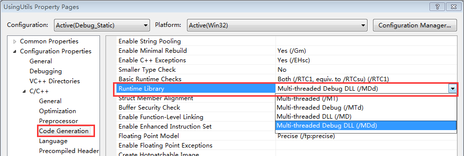
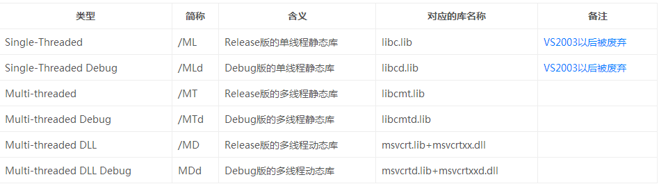
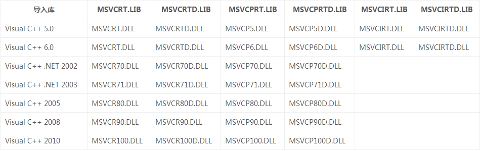
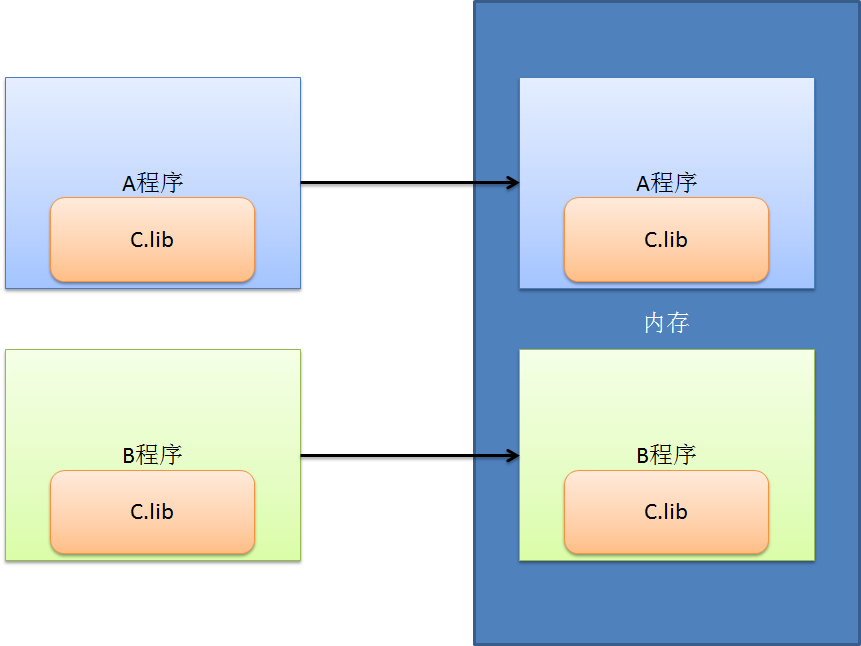
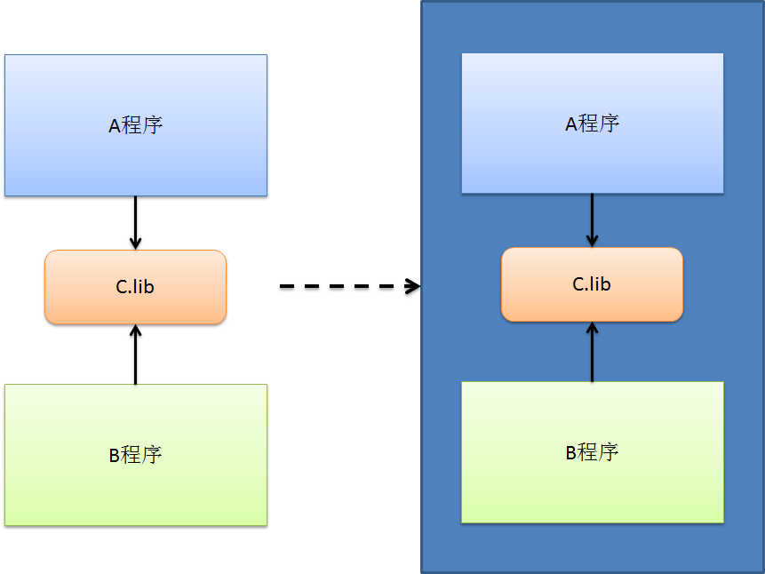

# 带你玩转 Visual Studio——带你跳出坑爹的 Runtime Library 坑

上一篇文章[带你玩转 Visual Studio——带你理解微软的预编译头技术](http://blog.csdn.net/luoweifu/article/details/49010627)我们了解了微软的预编译头技术，预编译的方式让我们的工程编译的更加快速；本篇文章将继续介绍微软的另一项技术，也就是运行时库 Runtime Library。

在 Windows 下进行 C++的开发，不可避免的要与 Windows 的底层库进行交互，然而 VS 下的一项设置 MT、MTd、MD 和 MDd 却经常让人搞迷糊，相信不少人都被他坑过，特别是你工程使用了很多第三库的时候，及容易出现各种链接问题。看一下下面这个错误提示： 
LIBCMT.lib(_file.obj) : error LNK2005: ___initstdio already defined in libc.lib(_file.obj) 
LIBCMT.lib(_file.obj) : error LNK2005: ___endstdio already defined in libc.lib(_file.obj)

有多少人被这玩意坑过，被坑过的请举脚！哈哈……

既然这里这么容易出问题，我们就有必要对其进行深入的了解，**知其然且知其所以然才能万事无惧！**

## 1. 什么是 Runtime Library？

Runtime Library 就是运行时库，也简称 CRT(C Run Time Library)。是程序在运行时所需要的库文件，通常运行时库是以 Lib 或 Dll 形式提供的。

Windows 下**C Runtime Library**是微软对 C 标准库函数的实现，这样每个程序可以直接使用 C 标准库的函数；后来出现了 C++，于是又在 C Runtime Library 基础上开发了**C++ Runtime Library**，实现了对 C++标准库的支持。因此现在 Windows 下的 C/C++ 运行时库既包含子 C 标准库，也包含了 C++ 标准库。如果你安装了 VS2010，在安装目录下的 VC\crt\src 下(如我的目录是 C:\Program Files (x86)\Microsoft Visual Studio 10.0\VC\crt\src)有运行时库(CRT)的源代码，这里既有 C 的文件(如 output.c、stdio.h 等)，也有 C++ 的文件(如 iostream、string)。

在 C Runtime Library 出现之前，许多程序都使用 C 编写，而这些程序都要使用标准的 C 库，按照以前的方式每一个程序最终都要拷贝一份标准库的实现到程序中，这样同一时刻内存中可能有许多份标准库的代码（一个程序一份），所以微软出于效率的考虑把标准 C 库做为动态链接来实现，这样多个程序使用 C 标准库时内存中就只有一份拷贝了。

确切地说运行时库指的就是对这些底层的基础功能实现的动态库( Dll ),运行时库和普通的 Dll 一样，只有程序用到了它才会被加载，没有程序使用的时候不会驻留内存的。话虽如此，但有多少系统的东西说不定也是用 C 写的，这些东西的存在就使 C 运行时库存在于内存中了，所以运行时库几乎总是需要的。虽然说运行时库应该是动态库，但习惯上我们把与动态运行时库相同代码编译出来的静态库也称为运行时库，因此 VC++下的运行时库有 ML、MLd、MT、MTd、MD、MD 六种(这个后面会讲)。

### 1.1 运行时库的主要作用

提供 C 标准库(如 memcpy、printf、malloc 等)、C++ 标准库（STL）的支持。

应用程序添加启动函数，启动函数的主要功能为将要进行的程序初始化，对全局变量进行赋初值，加载用户程序的入口函数。

不采用宽字符集的控制台程序的入口点为 mainCRTStartup(void) 。下面我们以该函数为例来分析运行时库究竟为我们添加了怎样的入口程序。这个函数在 crt0.c 中被定义，下列的代码经过了笔者的整理和简化：

```
void mainCRTStartup(void)
{
　int mainret;
　/*获得 WIN32 完整的版本信息*/
　_osver = GetVersion();
　_winminor = (_osver >> 8) & 0x00FF ;
　_winmajor = _osver & 0x00FF ;
　_winver = (_winmajor << 8) + _winminor;
　_osver = (_osver >> 16) & 0x00FFFF ;
　_ioinit(); /* initialize lowio */
　/* 获得命令行信息 */
　_acmdln = (char *) GetCommandLineA();
　/* 获得环境信息 */
　_aenvptr = (char *) __crtGetEnvironmentStringsA();
　_setargv(); /* 设置命令行参数 */
　_setenvp(); /* 设置环境参数 */
　_cinit(); /* C 数据初始化：全局变量初始化，就在这里！*/
　__initenv = _environ;
　mainret = main( __argc, __argv, _environ ); /*调用 main 函数*/
　exit( mainret );
}
```

从以上代码可知，运行库在调用用户程序的 main 或 WinMain 函数之前，进行了一些初始化工作。初始化完成后，接着才调用了我们编写的 main 或 WinMain 函数。只有这样，我们的 C 语言运行时库和应用程序才能正常地工作起来。

除了 crt0.c 外，C 运行时库中还包含 wcrt0.c、 wincrt0.c、wwincrt0.c 三个文件用来提供初始化函数。wcrt0.c 是 crt0.c 的宽字符集版，wincrt0.c 中包含 windows 应用程序的入口函数，而 wwincrt0.c 则是 wincrt0.c 的宽字符集版。

### 2. MT、MTd、MD、MDd、( ML、MLd 已废弃)的区别与原理

我们可以在 Properties->Configuration Properties->C/C++->Code Generation->Runtime Library 中设置采用的运行时库的类型。 



在[带你玩转 Visual Studio——带你发布自己的工程库](http://blog.csdn.net/luoweifu/article/details/48895765)一文中已经详细讲解了静态库 (Lib) 与动态库 (Dll) 的区别。我们知道编译出的静态库只有一个 ProjectName.lib 文件，而编译出的动态库有两个文件：ProjectName.lib+ProjectName.dll，一个是导入库，一个动态库。

**VC++中有六种 Runtime Library 的类型:**



你可以在 VS 的安装目录下找到这些库文件，如我的 VS2010 安装在 C:\Program Files (x86)\Microsoft Visual Studio 10.0，则可以在 C:\Program Files (x86)\Microsoft Visual Studio 10.0\VC\lib\和 C:\Program Files (x86)\Microsoft Visual Studio 10.0\VC\lib\amd64\中分别找到对应 32 位和 64 位的 libcmt.lib、libcmtd.lib、msvcrt.lib、msvcrtd.lib 库。libc.lib 和 libcd.lib 由于在 VS2005 就已经废弃了，所以在这肯定找不到。

通过上面的表格你会发现，多线程的动态运行时库是| msvcrt.lib+msvcrtxx.dll，之所以是 msvcrtxx.dll 是因为每一个版本的 VS 使用的库名称还不一样。而且还不止包含一个库，除了主要的 MSVCRT 库外，还有 MSVCPRT、MSVCIRT 库。它们之间的对应关系如下：



参考阅读：https://support.microsoft.com/en-us/kb/154753

在你的 VS 安装目录下(如 C:\Program Files (x86)\Microsoft Visual Studio 10.0\VC\redist\x64\Microsoft.VC100.CRT)，及系统目录 C:\Windows\System32、C:\Windows\SysWOW64 下都能找到对应的.dll 库。

很多的软件在发布自己的产品时也都会带上这些 DLL (防止用户的操作系统没有安装 VS，或在系统目录下找不到对应的 DLL )，如我电脑上的百度影音安装目录下就有 MSVCR71.DLL(C:\Program Files (x86)\baidu\BaiduPlayer\4.1.2.286\MSVCR71.DLL)，WPS 的安装目录下有 msvcr100.dll(C:\Program Files (x86)\WPS Office\9.1.0.5132\wtoolex\msvcr100.dll)和 msvcp100.dll(C:\Program Files (x86)\WPS Office\9.1.0.5132\wtoolex\msvcp100.dll)

(1). 静态链接的单线程库 

静态链接的单线程库只能用于单线程的应用程序， C 运行时库的目标代码最终被编译在应用程序的二进制文件中。通过 /ML 编译选项可以设置 Visual C++ 使用静态链接的单线 
程库。 

(2). 静态链接的多线程库 

静态链接的多线程库的目标代码也最终被编译在应用程序的二进制文件中，但是它可以在多线程程序中使用。通过 /MT 编译选项可以设置 Visual C++ 使用静态链接的多线程库。 

该选项生成的可执行文件运行时不需要运行时库 dll 的参加，会获得轻微的性能提升，但最终生成的二进制代码因链入庞大的运行时库实现而变得非常臃肿。当某项目以静态链接库的形式嵌入到多个项目，则可能造成运行时库的内存管理有多份，最终将导致致命的“ Invalid Address specified to RtlValidateHeap”问题。 
(3). 动态链接的运行时库 
动态链接的运行时库将所有的 C 库函数保存在一个单独的动态链接库 MSVCRTxx.DLL 中， MSVCRTxx.DLL 处理了多线程问题。使用 /MD 编译选项可以设置 Visual C++ 使用动态。 
链接时将按照传统 VC 链接 dll 的方式将运行时库 MSVCRxx.DLL 的导入库 MSVCRT.lib 链接，在运行时要求安装了相应版本的 VC 运行时库可再发行组件包（当然把这些运行时库 dll 放在应用程序目录下也是可以的）。 因/MD 和/MDd 方式不会将运行时库链接到可执行文件内部，可有效减少可执行文件尺寸。当多项目以 MD 方式运作时，其内部会采用同一个堆，内存管理将被简化，跨模块内存管理问题也能得到缓解。

/MDd 、 /MLd 或 /MTd 选项使用 Debug runtime library ( 调试版本的运行时刻函数库 ) ，与 /MD 、 /ML 或 /MT 分别对应。 Debug 版本的 Runtime Library 包含了调试信息，并采用了一些保护机制以帮助发现错误，加强了对错误的检测，因此在运行性能方面比不上 Release 版本。

**结论：/MD 和/MDd 将是潮流所趋，/ML 和/MLd 方式请及时放弃，/MT 和/MTd 在非必要时最好也不要采用了。**

### 3. 如何避免这种错误

3.1. **/MD 和/MDd 将是潮流所趋,/ML 和/MLd 方式请及时放弃,/MT 和/MTd 在非必要时最好也不要采用了。** 尽量使用/MD、/MDd 这种方式，除非有某些特殊的需要,如希望编译出来的.exe 可执行文件不需要依赖运行时库的.dll； 
2. ** 在多工程开发时，所有的工程使用同一种运行时库。**如 Utils 的 Solution 下有两个 Project：Utils 和 UsingUtils，UsingUtils 工程要使用 Utils 工程编译出来的库。如果 Utils 使用了/MDd 的方式，UsingUtils 也要使用/MDd 的方式，否则会报链接错误。 
如果 Utils 使用 MTd 的方式，而 UsingUtils 使用/MDd 的方式，则会出现重定义的错误，如：

1>LIBCMTD.lib(setlocal.obj) : error LNK2005: __configthreadlocale already defined in MSVCRTD.lib(MSVCR100D.dll)
1>LIBCMTD.lib(dbgheap.obj) : error LNK2005: __free_dbg already defined in MSVCRTD.lib(MSVCR100D.dll)
1>LIBCMTD.lib(dbgheap.obj) : error LNK2005: __CrtSetCheckCount already defined in MSVCRTD.lib(MSVCR100D.dll)
这是因为 Utils 使用 MTd 的方式，包含了 libcmtd.lib 库；而 UsingUtils 使用/MDd 的方式，要包含 msvcrtd.lib+msvcrtxxd.dll。libcmtd.lib 和 msvcrtd.lib 是用相同代码编译的，一个是静态库，一个动态库的导入库，同时包含 libcmtd.lib 和 msvcrtd.lib 肯定就对相同的函数进行了重复的定义。

以 Release 方式进行编译时使用 Release 的库，使用 Debug 的方式编译时使用 Debug 的库。如编译 Release 版本的 UsingUtils 时，要使用 Release 方式编译出来的 Utils 库，编译 Debug 版本的 UsingUtils 时，要使用 Debug 方式编译出来的库。 

### 4. 历史发展的角度讲解运行时库

#### 4.1 从操作系统的角度出发
 
我们知道操作系统一般是用 C 写的(因为那时还没有 C++，C 已经算是最高级的计算机语言了)，不管是 Linux/ Unix 还是 Windows 底层都是大量的 C 代码。在开发操作系统及相应的应用程序时，很多的程序都会用到相同基础功能的函数库。为了方便开发就把经常用到的底层的基础函数封闭成库(不然你每写一个程序都要把这基础功能实现的源代码拷贝一份到自己的工程，或自己再实现一次)，于是就有了 C 运行时库(C Runtime Library)，也就是静态库 libc.lib(Release 版)、libcd.lib(Debug 版)。

因为早期的操作系统和程序都相应简单，用户的需求也不高，那时的操作系统还没有多任务、多线程的概念。所以 libc.lib、libcd.lib 当然只能支持单线程的程序，而无法支持多线程的程序，因此这个运行时库叫 Single-Threaded(/ML)的方式。

后来，随着计算机的普及和发展，计算机要完成的任务越来越多，人们对时间和性能的要求也越来越高，为满足这些需求，操作系统就有了多任务的概念，也有了多线程的技术。而之前的运行时库 libc.lib、libcd.lib 只能用于单线程，已经无法满足很多程序的需要，于是多线程的运行时库也就应运而生，这就是 libcmt.lib、libcmtd.lib，也就是/MT、/MTd 的方式。

/MT、/MTd 解决了多线程的问题，但随着程序的越来越复杂，一个程序可能会用到多个其他程序的库，多个程序可能会用到相同的库，在内存中会保存多份的相同的静态库。假设 A 程序使用了 C.lib，B 程序也使用了 C.lib，A、B 程序同时运行时，在内存中就会同时存在两份 C.lib。 


静态库在内存中的呈现方式

为了解决这个问题，就产生了动态库的技术。于是就有了动态的运行时库 Multi-threaded DLL(/MD)、Multi-threaded DLL Debug(/MDd)。多个程序使用同一个动态库，在内存中只会有一份，效果图如下 


#### 4.2 从语言的角度

我们都知道，先有了 C 语言，后来才在 C 的基础上发展出了 C++ 语言，而 C++ 又对 C 兼容，相当是 C 的一个超集。 
一开始的运行时库，只是 C 的运行时库(C Runtime Library)，包含了对 C 标准函数的实现。后来随着 C++的产生，又把 C++ 程序运行时要用的底层基础库加了进去，就有了 C/C++的运行时库(C/C++ Runtime Library)，这时的运行时库既包含了标准 C 函数的实现，也包含了 C++ STL 的实现。