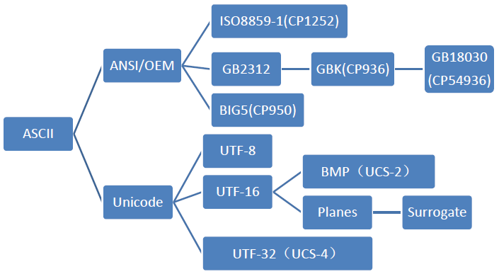
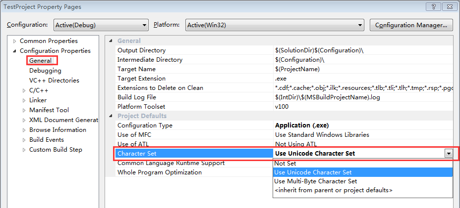
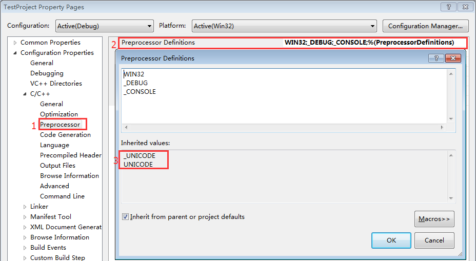
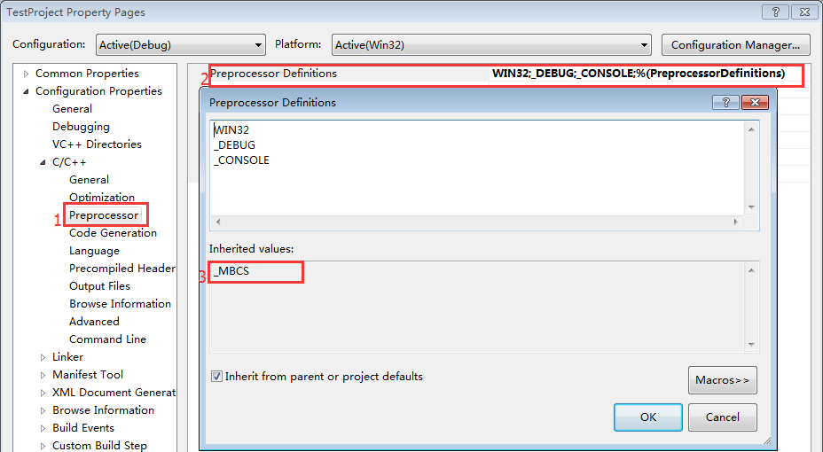
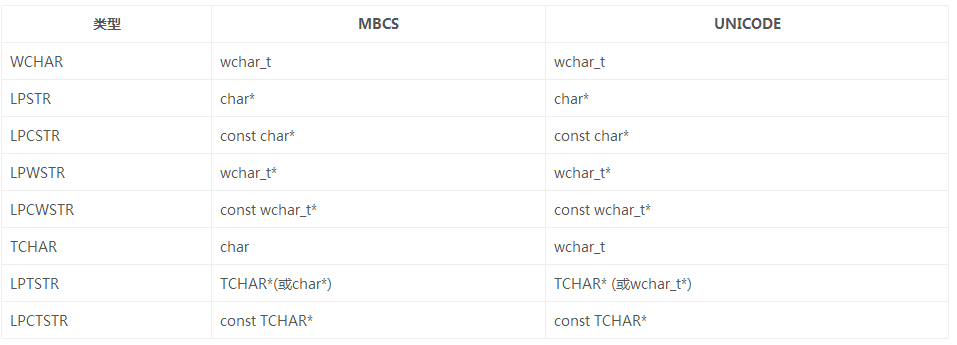
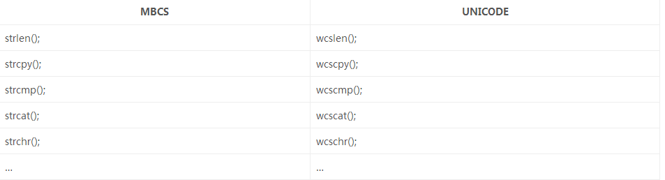

# 带你玩转 Visual Studio——带你理解多字节编码与 Unicode 码

上一篇文章[带你玩转 Visual Studio——带你跳出坑爹的 Runtime Library 坑](http://blog.csdn.net/luoweifu/article/details/49055933#comments)帮我们理解了 Windows 中的各种类型 C/C++运行时库及它的来龙去脉，这是 C++ 开发中特别容易误入歧途的一个地方，我们对它进行了总结和归纳。本篇文章我们将继续讲解 C++ 开发中容易混淆的另一个概念——多字节字符集与 Unicode 字符集。

## 多字节字符与宽字节字符

### char 与 wchar_t

我们知道 C++ 基本数据类型中表示字符的有两种：char、wchar_t。 
char 叫多字节字符，一个 char 占一个字节，之所以叫多字节字符是因为它表示一个字时可能是一个字节也可能是多个字节。一个英文字符(如’s’)用一个 char (一个字节)表示，一个中文汉字(如’中’)用 3 个 char (三个字节)表示，看下面的例子。
```
void TestChar()
{
    char ch1 = 's';             // 正确
    cout << "ch1:" << ch1 << endl;
    char ch2 = '中';             // 错误,一个 char 不能完整存放一个汉字信息
    cout << "ch2:" << ch2 << endl;

    char str[4] = "中";          //前三个字节存放汉字'中',最后一个字节存放字符串结束符\0
    cout << "str:" << str << endl;
    //char str2[2] = "国";       // 错误：'str2' : array bounds overflow
    //cout << str2 << endl;
}
```
结点如下：
```
ch1:s 
ch2: 
str:中
```

wchar_t 被称为宽字符，一个 wchar_t 占 2 个字节。之所以叫宽字符是因为所有的字都要用两个字节(即一个 wchar_t)来表示，不管是英文还是中文。看下面的例子：
```
void TestWchar_t()
{
    wcout.imbue(locale("chs"));     // 将 wcout 的本地化语言设置为中文

    wchar_t wch1 = L's';            // 正确
    wcout << "wch1:" << wch1 << endl;
    wchar_t wch2 = L'中';            // 正确,一个汉字用一个 wchar_t 表示
    wcout << "wch2:" << wch2 << endl;

    wchar_t wstr[2] = L"中";         // 前两个字节(前一个 wchar_t)存放汉字'中',最后两个字节(后一个 wchar_t)存放字符串结束符\0
    wcout << "wstr:" << wstr << endl;
    wchar_t wstr2[3] = L"中国";
    wcout << "wstr2:" << wstr2 << endl;
}
```

结果如下：

```
ch1:s 
ch2:中 
str:中 
str2:中国
```

**说明**： 
1. 用常量字符给 wchar_t 变量赋值时，前面要加 L 。如： wchar_t wch2 = L’中’; 
2. 用常量字符串给 wchar_t 数组赋值时,前面要加 L 。如： wchar_t wstr2[3] = L”中国”; 
3. 如果不加 L ，对于英文可以正常，但对于非英文(如中文)会出错。

### string 与 wstring

字符数组可以表示一个字符串，但它是一个定长的字符串，我们在使用之前必须知道这个数组的长度。为方便字符串的操作，STL 为我们定义好了字符串的类 string 和 wstring 。大家对 string 肯定不陌生，但 wstring 可能就用的少了。

string 是普通的多字节版本，是基于 char 的，对 char 数组进行的一种封装。

wstring 是 Unicode 版本，是基于 wchar_t 的，对 wchar_t 数组进行的一种封装。

string 与 wstring 的相关转换：

以下的两个方法是跨平台的，可在 Windows 下使用，也可在 Linux 下使用。

```
#include <cstdlib>
#include <string.h>
#include <string>

// wstring => string
std::string WString2String(const std::wstring& ws)
{
    std::string strLocale = setlocale(LC_ALL, "");
    const wchar_t* wchSrc = ws.c_str();
    size_t nDestSize = wcstombs(NULL, wchSrc, 0) + 1;
    char *chDest = new char[nDestSize];
    memset(chDest,0,nDestSize);
    wcstombs(chDest,wchSrc,nDestSize);
    std::string strResult = chDest;
    delete []chDest;
    setlocale(LC_ALL, strLocale.c_str());
    return strResult;
}

// string => wstring
std::wstring String2WString(const std::string& s)
{
    std::string strLocale = setlocale(LC_ALL, ""); 
    const char* chSrc = s.c_str();
    size_t nDestSize = mbstowcs(NULL, chSrc, 0) + 1;
    wchar_t* wchDest = new wchar_t[nDestSize];
    wmemset(wchDest, 0, nDestSize);
    mbstowcs(wchDest,chSrc,nDestSize);
    std::wstring wstrResult = wchDest;
    delete []wchDest;
    setlocale(LC_ALL, strLocale.c_str());
    return wstrResult;
}
```

## 字符集(Charcater Set)与字符编码(Encoding)

**字符集（Charcater Set 或 Charset）**：是一个系统支持的所有抽象字符的集合，也就是一系列字符的集合。字符是各种文字和符号的总称，包括各国家文字、标点符号、图形符号、数字等。常见的字符集有： ASCII 字符集、GB2312 字符集(主要用于处理中文汉字)、GBK 字符集(主要用于处理中文汉字)、Unicode 字符集等。

**字符编码（Character Encoding）**：是一套法则，使用该法则能够对自然语言的字符的一个字符集（如字母表或音节表），与计算机能识别的二进制数字进行配对。即它能在符号集合与数字系统之间建立对应关系，是信息处理的一项基本技术。通常人们用符号集合（一般情况下就是文字）来表达信息，而计算机的信息处理系统则是以二进制的数字来存储和处理信息的。字符编码就是将符号转换为计算机能识别的二进制编码。

一般一个字符集等同于一个编码方式，ANSI 体系( ANSI 是一种字符代码，为使计算机支持更多语言，通常使用 0x80~0xFF 范围的 2 个字节来表示 1 个字符)的字符集如 ASCII、ISO 8859-1、GB2312、 GBK 等等都是如此。一般我们说一种编码都是针对某一特定的字符集。 

一个字符集上也可以有多种编码方式，例如 UCS 字符集(也是 Unicode 使用的字符集)上有 UTF-8、UTF-16、UTF-32 等编码方式。 

从计算机字符编码的发展历史角度来看，大概经历了三个阶段： 
第一个阶段：ASCII 字符集和 ASCII 编码。 
计算机刚开始只支持英语(即拉丁字符)，其它语言不能够在计算机上存储和显示。ASCII 用一个字节( Byte )的 7 位(bit)表示一个字符，第一位置 0。后来为了表示更多的欧洲常用字符又对 ASCII 进行了扩展，又有了 EASCII，EASCII 用 8 位表示一个字符，使它能多表示 128 个字符，支持了部分西欧字符。

第二个阶段: ANSI 编码（本地化） 
为使计算机支持更多语言，通常使用 0x80~0xFF 范围的 2 个字节来表示 1 个字符。比如：汉字 ‘中’ 在中文操作系统中，使用 [0xD6,0xD0] 这两个字节存储。 
不同的国家和地区制定了不同的标准，由此产生了 GB2312, BIG5, JIS 等各自的编码标准。这些使用 2 个字节来代表一个字符的各种汉字延伸编码方式，称为 ANSI 编码。在简体中文系统下，ANSI 编码代表 GB2312 编码，在日文操作系统下，ANSI 编码代表 JIS 编码。 
不同 ANSI 编码之间互不兼容，当信息在国际间交流时，无法将属于两种语言的文字，存储在同一段 ANSI 编码的文本中。

第三个阶段：UNICODE（国际化） 
为了使国际间信息交流更加方便，国际组织制定了 UNICODE 字符集，为各种语言中的每一个字符设定了统一并且唯一的数字编号，以满足跨语言、跨平台进行文本转换、处理的要求。UNICODE 常见的有三种编码方式:UTF-8(1 个字节表示)、UTF-16((2 个字节表示))、UTF-32(4 个字节表示)。

我们可以用一个树状图来表示由 ASCII 发展而来的各个字符集和编码的分支： 


图 1： 各种类型的编译

如果要更详细地了解字符集和字符编码请参考： 
[字符集和字符编码（Charset & Encoding）](http://blog.csdn.net/luoweifu/article/details/49385121)

## 工程里多字节与宽字符的配制

右键你的工程名->Properties，设置如下： 


图 2： Character Set

1. 当设置为 Use Unicode Character Set 时，会有预编译宏：_UNICODE、UNICODE


图 3： Unicode

当设置为 Use Multi-Byte Character Set 时，会有预编译宏：_MBCS 



### Unicode Character Set 与 Multi-Byte Character Set 有什么区别呢？

Unicode Character Set 和 Multi-Byte Character Set 这两个设置有什么区别呢？我们来看一个例子: 
有一个程序需要用 MessageBox 弹出提示框：

```
#include "windows.h"

void TestMessageBox()
{
    ::MessageBox(NULL, "这是一个测试程序!", "Title", MB_OK);
}
```

上面这个 Demo 非常简单不用多说了吧！我们将 Character Set 设置为 Multi-Byte Character Set 时，可以正常编译和运行。但当我们设置为 Unicode Character Set，则会有以下编译错误：
```
error C2664: ‘MessageBoxW’ : cannot convert parameter 2 from ‘const char [18]’ to ‘LPCWSTR’
```

这是因为 MessageBox 有两个版本，一个 MessageBoxW 针对 Unicode 版的，一个是 MessageBoxA 针对 Multi-Byte 的，它们通过不同宏进行隔开，预设不同的宏会使用不同的版本。我们使用了 Use Unicode Character Set 就预设了_UNICODE、UNICODE 宏，所以编译时就会使用 MessageBoxW ，这时我们传入多字节常量字符串肯定会有问题，而应该传入宽符的字符串，即将 ”Title” 改为 L ”Title” 就可以了，”这是一个测试程序!”也一样。

```
WINUSERAPI
int
WINAPI
MessageBoxA(
    __in_opt HWND hWnd,
    __in_opt LPCSTR lpText,
    __in_opt LPCSTR lpCaption,
    __in UINT uType);
WINUSERAPI
int
WINAPI
MessageBoxW(
    __in_opt HWND hWnd,
    __in_opt LPCWSTR lpText,
    __in_opt LPCWSTR lpCaption,
    __in UINT uType);
#ifdef UNICODE
#define MessageBox  MessageBoxW
#else
#define MessageBox  MessageBoxA
#endif // !UNICODE
```

上面的 Multi-Byte Character Set 一般是指 ANSI （多字节）字符集，关于 ANSI 请参考[第二小节字符集(Charcater Set)](http://blog.csdn.net/luoweifu/article/details/49382969#t4)与字符编码(Encoding)。而  Unicode Character Set 就是 Unicode 字符集，一般是指 UTF-16 编码的 Unicode 。也就是说每个字符编码为两个字节，两个字节可以表示 65535 个字符，65535 个字符可以表示世界上大部分的语言。

一般推荐使用 Unicode 的方式，因为它可以适应各个国家语言，在进行软件国际时将会非常便得。除非在对存储要求非常高的时候，或要兼容 C 的代码时，我们才会使用多字节的方式 。

## 理解_T()、_Text()宏即 L”“

[上一小节](http://blog.csdn.net/luoweifu/article/details/49382969#t6)对 MessageBox 的调用中除了使用 L”Title” 外，还可以使用_T(“Title”)和_TEXT(“Title”)。而且你会发现在 MFC 和 Win32 程序中会更多地使用_T 和 _TEXT，那_T、_TEXT 和 L 之间有什么区别呢？

通过第一小节[多字节字符与宽字节字符](http://blog.csdn.net/luoweifu/article/details/49382969#t0)我们知道表示多字节字符 (char) 串常量时用一般的双引号括起来就可以了，如”String test”；而表示宽字节字符 (wchar_t)串常量时要在引号前加 L，如 L”String test”。

查看 tchar.h 头文件的定义我们知道_T 和 _TEXT 的功能是一样的，是一个预定义的宏。
```
#define _T(x)       __T(x)
#define _TEXT(x)    __T(x)
```

我们再看看 __T(x) 的定义，发现它有两个：

```
#ifdef  _UNICODE
// ... 省略其它代码
#define __T(x)      L ## x
// ... 省略其它代码
#else   /* ndef _UNICODE */
// ... 省略其它代码
#define __T(x)      x
// ... 省略其它代码
#endif  /* _UNICODE */
```

这下明白了吗？当我们的工程的 Character Set 设置为 Use Unicode Character Set 时_T 和_TEXT 就会在常量字符串前面加 L，否则(即 Use Multi-Byte Character Set 时)就会以一般的字符串处理。

## Dword、LPSTR、LPWSTR、LPCSTR、LPCWSTR、LPTSTR、LPCTSTR

VC++ 中还有一些常用的宏你也许会范糊涂，如 Dword、LPSTR、LPWSTR、LPCSTR、LPCWSTR、LPTSTR、LPCTSTR。这里我们统一总结一下： 
常见的宏：



**相互转换方法： **
LPWSTR->LPTSTR: W2T(); 
LPTSTR->LPWSTR: T2W(); 
LPCWSTR->LPCSTR: W2CT(); 
LPCSTR->LPCWSTR: T2CW();

ANSI->UNICODE: A2W(); 
UNICODE->ANSI: W2A();

**字符串函数：** 
还有一些字符串的操作函数，它们也有一 一对应关系：



通过这些函数和宏的命名你也许就发现了一些霍规律，一般带有前缀 w (或后缀 W )的都是用于宽字符的，而不带前缀 w (或带有后缀 A )的一般是用于多字节字符的。

## 理解 CString 产生的原因与工作的机理

CString：动态的 TCHAR 数组，是对 TCHAR 数组的一种封闭。它是一个完全独立的类，封装了“+”等操作符和字符串操作方法，换句话说就是 CString 是对 TCHAR 操作的方法的集合。它的作用是方便 WIN32 程序和 MFC 程序进行字符串的处理和类型的转换。

关于 CString 更详细的用法请参考： 
[CString 与 string、char*的区别和转换](http://blog.csdn.net/luoweifu/article/details/20232379)
[CString 的常见用法](http://www.cnblogs.com/Caiqinghua/archive/2009/02/16/1391190.html)