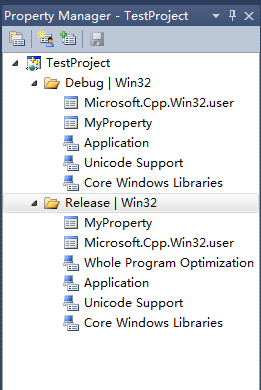
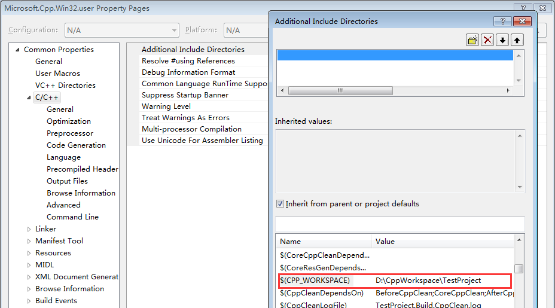

# 带你玩转 Visual Studio——Property Manager 的配制

## 从问题入手

### 抛出问题

在我的电脑上原本安装了 VS2010 专业版，现在由于项目的需要又安装了 VS2015，但原来的 VS2010 用不了，在 VS2010 下编译程序时报如下错误：
```
1>TRACKER : error TRK0002: Failed to execute command: “”C:\Program Files (x86)\Microsoft Visual Studio 14.0\VC\bin\amd64_x86\CL.exe” @C:\Users\Administrator\AppData\Local\Temp\tmp6095048feb5e4db6845129a7e84fde38.rsp”. 操作标识符不正确。
```

### 解决方案

从这个错误提示中我们可以发现，用 VS2010 编译时用的是 VS2015 的编译器 (Visual Studio 14.0)，而且是 64 位的，说明是用的编译器不匹配，那如何设置回 VS2010 的编译器呢？ 
通过 Google 找到了如下答案： 

菜单 View->Property Manager->Debug|Win32->Microsoft.Cpp.Win32.user，双击它打开设置页，查看 VC++ Directories->Executable Directories 值，我们会发现果然设置成了 VS2015 的编译器，将它改了，设置成 VS2010 安装目录下的 VC\bin 目录，如我的是：C:\Program Files (x86)\Microsoft Visual Studio 10.0\VC\bin。 


再次编译程序，会发现这个错误没有了，完美搞定！

但  Property Manager 这个设置以前还真没怎么用过，它有什么功能呢？它与右键工程->Properties 的属性页又有什么区别呢？于是对它进行了深一步的探索！

## 深入研究

### 概念性了解

首先，明白两个概念：Project Property 和 Property Sheet。 
Project Property：又称项目属性，是你当前项目的属性配制，保存在你工程的配制文件中， ProjectName.vcxproj 中。

Property Sheet：又称属性表，可用于多个工程的属性配制，可以自己创建添加属性配制，也可以使用系统默认的属性表，保存在.props 为拓展名的文件中。而属性表( Property Sheet)的添加和管理就是在 Property Manager 中进行设置的。

### Property Manager 的使用

1. 打开 Property Manager 窗口。菜单 View->Property Manager 或 View->Other Windows->Property Manager。可看到如下界面：

 
Property Manager

2. 属性的设置。双击属性表名称(如 Microsoft.Cpp.Win32.user )就可以对它进行设置了。你会发现它的配制项与右键工程->Properties 打开的项目属性是一样的。Microsoft.Cpp.Win32.user 是当前系统用户默认的属性表，保存在 C:\Users\Administrator\AppData\Local\Microsoft\MSBuild\v4.0\Microsoft.Cpp.Win32.user.props 中，使用这个用户名登录操作系统，用 VS 创建的所用项目都会继承这个属性表的配制属性。

3. 设置 VC++ Directories。在这个配制项中，我们可以设置 VC++ 编译、链接需要的各种工具和资源的路径。 

 
VC++ Directories

Executable Directories:可执行程序(如 cl.exe、link.exe、lib.exe 等)的路径，一般会包含 VC\bin 的路径； 
Include Directories:要包含的头文件(如 CRT 的头文件)的路径，一般会包含 VC\include 的路径； 
Reference Directories:引用的库的路径，如 MFC 的库(VC\atlmfc\lib)； 
Libbrary Directories:要包含的 lib 库的路径，一般会包含 VC\lib 的路径； 
Source Directories: 源代码的路径，一般会包含 VC\crt\src 的路径； 
Exclude Directories: 不被包含文件的路径。

4. 自定义宏。在配制工程属性时你是否经常会看到一些宏，如(SolutionDir)、(Configuration)、$(OutDir )等，但你却不知道如何更改它，这些都是 MSBuild 为你预定义的一些宏。其实你也可以定义一些自己的宏，甚至可以重写原有的宏。方法如下： 

 
User Macros

这时你在配制自己的工程属性(如 Additional Include Directories )时就能看到自己定义的宏了： 

 

5. 添加或导入 Property Sheet。这个太简单了，直接看图： 
 
 
Import and Export Property sheet 

这样你可以在创建同一类型的项目时都(导入进来)使用自己定义的属性表，就可以多个项目使用相同的设置了，减少设置的负担。
属性的继承关系

项目的属性是分层的。 每一层会继承前一层的值，但是继承的值可以通过设置属性来显式地重写。 下面是基本的继承关系(继承树)： 
1. 来自 MSBuild CPP 工具集的默认设置(..\Program Files\MSBuild\Microsoft.Cpp\v4.0\Microsoft.Cpp.Default.props，它将被 ProjectName.vcxproj 文件导入)。 
2. Property sheets (属性表)，也就是 Property Manager 中设置的属性表。 
3. 工程文件 ProjectName.vcxproj .(可以重写默认值和 property sheet 中的设置)。 
4. 每一项的元数据。

参考文章：https://msdn.microsoft.com/en-us/library/669zx6zc.aspx