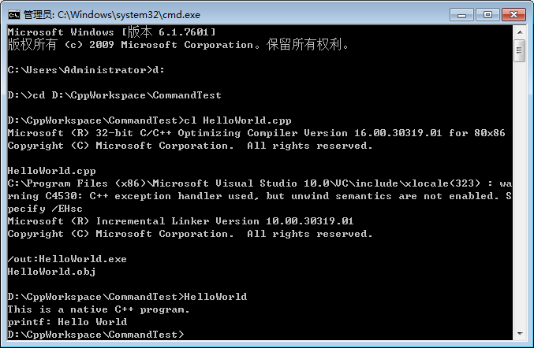

# 带你玩转 Visual Studio——命令行编译 C/C++程序

## VS 构建工具介绍

我们都知道 C/C++ 源代码要生成可执行的.exe 程序，需要经过编译、链接的过程。你在 VS 工具中只需要选择菜单 Build 或按一下 F5 可以编译、链接、运行了，其实 IDE 帮我隐藏了好多的具体细节。

我先假设 VS2010 安装在以下目录中：

```
C:\Program Files (x86)\Microsoft Visual Studio 10.0
```
cl.exe：编译程序 
link.exe：链接程序 
lib.exe：加载 lib 库的程序 
nmake.exe：用 makefile 进行构建、编译的工具

命令行编译程序

要在命令行(而不是 VS )中编译程序，先要配制环境变量。网上有些教程说执行 VSDIR\VC\bin\vcvars32.bat 的批处理就可以了，但我执行这个批处理时会报错：

```
Setting environment for using Microsoft Visual Studio 2010 x86 tools.
```
这又是另外一个问题，我就不管了，直接手动配制环境变量把： 
右键我的计算机->属性->高级系统设置->高级->环境变量，配制的环境变量(建议配制在用户的环境变量中)的值如下： 

**VS2010_DIR： **
C:\Program Files (x86)\Microsoft Visual Studio 10.0 
**WIN_SDK：** 
C:\Program Files (x86)\Microsoft SDKs 
**path：** 
C:\Users\Administrator.dnx\bin;%VS2010_DIR%\VC\bin;%VS2010_DIR%\Common7\IDE 
**include： **
%VS2010_DIR%\VC\include;%WIN_SDK%Windows\v7.0A\Include; 
**lib：** 
%VS2010_DIR%\VC\lib;%WIN_SDK%\Windows\v7.0A\Lib;

测试

D:\CppWorkspace\CommandTest\HelloWorld.cpp:
```
#include <iostream>
#include <stdio.h>

int main()
{
    std::cout << "This is a native C++ program." << std::endl;
    printf("printf: Hello World");
    return 0;
}
```
编译结果： 

命令行中编译 C/C++程序

HelloWorld.obj 就是编译出的二进制文件，HelloWorld.exe 就是链接成的可执行文件。

### 说明

在以上的编译过程中我们只用了 cl 的编译命令就帮我们最终的可执行文件 HelloWorld.exe ，这是因为 cl.exe 程序在编译时自己会去调用 link.exe、lib.exe 等程序。
 
可通过 ”cl -help “ 查看常用的编译选项


更详细的中文介绍也可参考这篇博文： 
http://www.lellansin.com/%E5%BE%AE%E8%BD%AF-cl-exe-%E7%BC%96%E8%AF%91%E5%99%A8.html