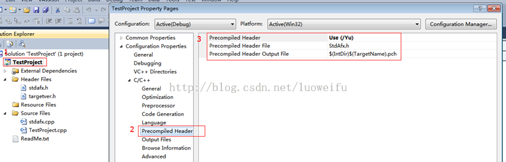
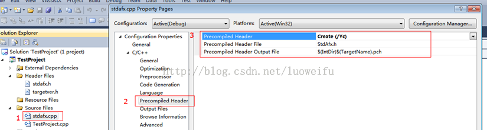

# 非 MFC 工程中使用 MFC 库

## 需求说明
C++ 工程的类型有很多，从 VS (或 VC) 可以看到常见的有: Win32 Console Application、MFC Application、Win32 Project 等。在创建 MFC 工程时，通过 IDE 的向导会自动帮我们创建相应的类文件和包含必需的头文件，但有时候我们需要在非 MFC 工程中包含 MFC 的库。至于为什么会有这个需要，为何不在一开始就创建 MFC 工程呢？可能有两种原因：1.在 MFC 工程会产生很多向导生成的代码以及资源文件，如基于单文档的工程会有 View , Doc 等类，很多时候我们并不需要这些东西，只需要一个空工程就可以了。2.使用第三方框架创建的工程，我们很难更改它的工程属性(如用 Firebreath 开发浏览器插件，通过脚本文件 firebreath 会自动帮我们生成 VS 下的工程)。

## 常见问题
在非 MFC 工程中使用 MFC 的库就需要包含相应的头文件，经常会遇到下面这个问题：
1. fatal error C1189: #error :  Building MFC application with /MD[d] (CRT dll version) requires MFC shared dll version. Please #define _AFXDLL or do not use /MD[d]
2. fatal error C1189: #error :  WINDOWS.H already included.  MFC apps must not #include <windows.h>

## 问题分析

对于第 1 个问题，很简单：

选中工程名右键属性 (Project)，在 Properties\Configuration Properties\General\Use of MFC 中选择 Use MFC in a Shared DLL 

出现上面第 2 个问题主要是因为包含头文件的顺序不对。为什么包含 WINDOWS.H 的时候会有顺序要求，网上有一段传播的非常广泛解释:

如果在 MFC 工程中#include   <windows.h>，那么会有以下编译错误（因为 afxwin.h 文件中包含了 afx.h，afx.h 文件中包含了 afxver_.h，afxver_.h 中包含了 afxv_w32.h，而 afxv_w32.h 中包含了 windows.h，请看以下分析）：

compile   error:   
c:\program   files\microsoft   visual   studio\vc98\mfc\include\afxv_w32.h(14)   :   
fatal   error   C1189:   #error   :     WINDOWS.H   already   included.     MFC   apps   must   not   #include   <windows.h>         
如果编译器在编译 afxv_w32.h 文件之前编译了 windows.h 文件，编译器会报上面的错误，因为在 afxv_w32.h 文件中有下面的一句预编译报警：
```   
#ifdef   _WINDOWS_   
#error   WINDOWS.H   already   included.     MFC   apps   must   not   #include   <windows.h>   
#endif 
```
问题在于为什么 afxv_w32.h 中要有这么一句预编译处理。看了 afxv_w32.h 和 windows.h 文件就有点明白了。   

在 afxv_w32.h 中有下面的预编译语句：   

```
...   ...   
#undef   NOLOGERROR   
#undef   NOPROFILER   
#undef   NOMEMMGR   
#undef   NOLFILEIO   
#undef   NOOPENFILE   
#undef   NORESOURCE   
#undef   NOATOM   
  ...   ...   
```

在 afxv_w32.h 中还有一句：
```
#include   "windows.h"   
```
而在 windows.h 文件中有下面的预编译语句：  
```
...   ...   
#define   NOATOM   
#define   NOGDI   
#define   NOGDICAPMASKS   
#define   NOMETAFILE   
#define   NOMINMAX   
#define   NOMSG   
#define   NOOPENFILE   
  ...   ...   
    
```
注意到在 windows.h 的开头有防止 windows.h 被重复编译的预编译开关：   
```
 #ifndef   _WINDOWS_   
 #define   _WINDOWS_   
    
```

这样问题就明白了，虽然我不知道微软为什么要这么做，但是我知道如果在 afxv_w32.h 没有那句预编译报警，那么如果在编译 afxv_w32.h 之前编译了 windows.h，那么在 windows.h 中 #define 的 NOATOM 等宏就会被#undef 掉，可能会导致相应的错误发生。   
    
猜想原因可能如上所述，我的解决方法是，将包含有 #include   “windows.h" 的头文件放在所有包含的头文件的最后面，这样使得对 afxv_w32 文件   

的编译处理发生在先，这样，由于在 afxv_w32.h 中已经包含了 windows.h ，那么宏 _WINDOWS _ 将被定义，后继的 #include    "windows.h" 语句将形同虚设，   

上面的编译报警也不会发生了。我觉得这种处理要比将所有的 #include   "windows.h” 语句删掉要好一点。   
    
一句话，编译器必须在编译 windows.h 之前编译 afxv_w32.h, 因为我不是十分清除什么时候 afxv_w32.h 会被编译，所以我将可能包含有#include   "windows.h" 的头文件放在其他头文件之后 #include。

## 参考解决方法

解决这个问题的总体思路是：把 ＃include <afxwin.h> 的包含语句把到最前面。
sunshine1314 的博文[《非 MFC 工程使用 MFC 库时的问题及解决办法》](http://blog.csdn.net/sunshine1314/article/details/459809)给出了一序列的解决方案，大家可能参考一下，也许能解决你们的问题。但我当时通过这一系列方法还是没能解决我的问题。

## 我的解决方案

我的问题是：用 Firebreath 开发浏览器插件，通过 fbgen.py 和 prep2010.cmd 脚本帮我们生成了基于 VS2010 的工程(这个工程中没有 stdaf.h)，我们要在这个工程中获得 MFC 中的 HDC 以及使用 MessageBox ，于是就碰到了上面提到的问题。
解决方案：
手动添加 stdafx.h 和 stdafx.cpp 文件使用预编译机制，在 stdafx.h 的最前面包含 <afxwin.h>。于是问题就变成了 stdafx.h 的原理和手动添加 stdafx.h 文件及相应配置。下面我们以 Win32 Console Application 工程的 TextProject 为例，演示一下这过程。
1. 在 VS2010 中创建 Win32 Console Application 工程的 TextProject，创建向导会自动生成的 stdafx.h 和 stdafx.cpp，省去了手动添加的过程。如果你的工程没有这两个文件可以手动创建。
2. stdafx.h 和 stdafx.cpp 这两个文件已创建并添加到工程，下面讲讲相关的配制。
2.1 选中工程名，右键属性(Properties)，在 Precompiled Header/Precompiled Header 中选择 Use(/Yu)，Precompiled Header File 中填 stdafx.h。设置工程编译时使用预编译头文件 stdafx.h (在 VS 中文件名的大小写不敏感，即 StdAfx.h 和 stdafx.h 是等价的)。



2.2 选中 stdafx.cpp 文件，右键属性 (Properties)，在 Precompiled Header/Precompiled Header 中选择 Create(/Yc), Precompiled Header File 中填 stdafx.h。这样设置的作用是：每次编译 stdafx.cpp 文件时创建.pch 文件(扩展名 pch 表示预编译头文件 )。



3.在 stdafx.h 的开发包含 <afxwin.h> 文件：

``` 
#include <afxwin.h>
```

4.这时在我们的 main 函数中写入下面这句话，就可以弹出一个消息框：
AfxMessageBox(L"非 MFC 工程使用 MFC 库", MB_OK, 0 );

## Stdafx.h 的原理

关于 stdafx.h 的原理请看下一篇文章[《预编译头文件 (stdafx.h) 的原理》](http://blog.csdn.net/luoweifu/article/details/41527289)。