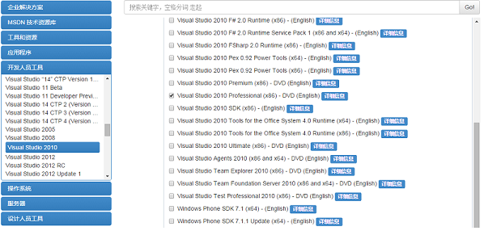
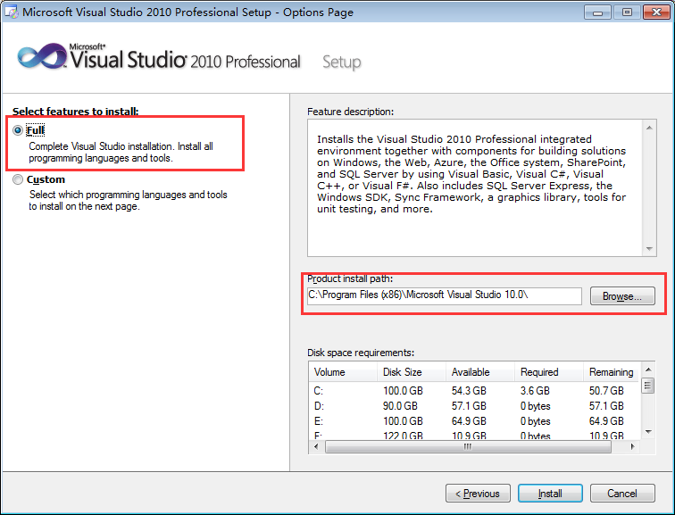
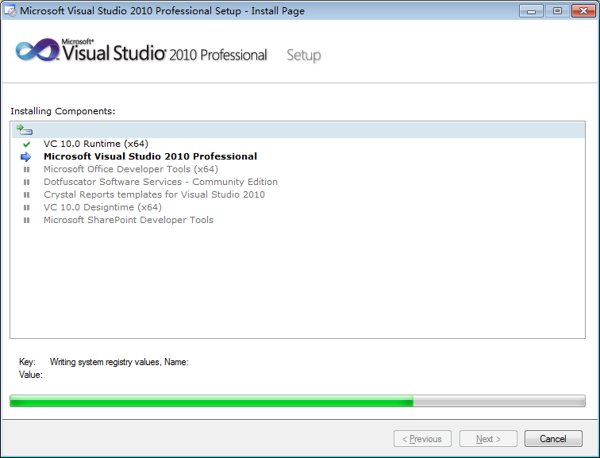

# 带你玩转 Visual Studio——开篇介绍

## 开篇之前，先唠叨几句

本人从事 C++ 开发工作一年半，总想就 C++ 开发方面写点东西。写什么呢？想了一下还是写点跟开发密切相关的吧，要说跟开发最密切相关的那莫过于就是开发工具了，也就是常常说的集成开发环境 (IDE)。 这一年多从事的是 C++ 的跨平台开发，在 Linux 和 Windows 下都开发过，但主要还是在 Windows 下进行开发(一般会在 Windows 下开发，多个平台下编译)，因为 Windows 下有强大好用的开发工具，那就 Visual Studio。

## 讲述的范围

本系列博文讲述的内容为：

1. Windows 下 Visual Studio 在 C++ 开发方面的功能和使用方法；
2. 用 Visual Studio 进行 C++的高效开发；
3. C++ 编译、链接的一些方法，以及部分跟编译相关的 Window 技术。
本系列博文相关用例的特定环境：

本系列博文相关用例的特定环境：

语言：C++ 
版本：VS2010 
系统：win7 x64

说明：

本系列博文虽然是基于 VS2010 进行说明的，但 Visual Studio 的各个版本在使用的方法、讲述的原理上应该是类似的，你可以将其中大部分的方法和原理拓展到 Visual Studio 的各个版本。

## VS2010 的下载、安装

VS2010 的下载：

用度娘搜一下 “VS2010 下载”你就可以看到非常多的下载地址，下一个可用的就行。 
在这里我要介绍一下官方的下载地址：http://msdn.itellyou.cn/， 选择“开发工具”\“Visual Studio 2010”，这里提供了各种版本：中文的、英文的，专业版、旗舰版等，此外还提供了基于 VS2010 的各种工具和插件。选择一个适合你自己的版本下载就好。(我用的英文的专业版 Professional) 

[msdn.itellyou.cn（MSDN,我告诉你）](http://msdn.itellyou.cn/)是微软官方的一个产品发布平台，只要你能想到的几乎所有的微软的产品在这里都能找到，比如各个版本的 Windows 操作系统，Office 软件套件，各个开发工具等、技术文档等。

VS2010 的安装：

这个非常简单，跟着向导一步一步来，基本不会有错。 
1. 将的下载的安装包解压，点击 setup.exe 进行安装； 
2. 点击 “Install Microsoft Visual Studio 2010” 进行安装； 
3. 到协议条款时选择同意接受(“I have read and accept the license terms.”)，然后下一步； 
4. 到这一步时，可以选择完整安装或自定义安装(一般选择完整安装，特别是你对 VS 还不太熟悉的时候)，可以设置你要的安装的路径。 

5. 等待安装，时间会比较长，耐心等待。 

6. 安装完毕后，关闭退出安装程序即可。

VS2010 的激活：

这个自己想办法(有钱的话也可以自己买一个)，说太多又要被微软举报了(这个在 CSDN 也不是什么稀奇的事，我就有过先列了)。

## 文后说明

写博客四年以来，这是头一篇“踩”的人数大于“顶”的人数，评论的人很多，但正面的很少。在这对各位的问题统一回答一下。

Q：这么烂的文章还放首页？ 
A：我也是看了你的评论后才知道上了首页，感谢您的提醒！

Q：虎头蛇尾，通篇下来其实什么也没说。 
A：首先必须要说明的是这是一个系列文章的第一篇。如果你把它当作单篇的文章来看，确实什么也没说；如果你把它当作一个系列的文章来看，这只是开头的第一篇，希望有好戏在后头。 
VS 是一个大型的企业级的开发工具，我尽量做到这里讲的内容也可以直接应用于企业级的开发。如果所讲的内容一两句话就能说明白，那也就没有必要写这些文章了，四年写博客的经验告诉我“短文多篇”的易读性要好于几万字的“通篇大论”，万望大家理解！

Q：VS2015 都出来了，怎么还写 VS2010 的？ 
A：只是因为我个人对 VS2010 比较熟悉，要写肯定就写自己最懂的啊！不然就更容易误人子弟了……如果原理你都知道了，再使用一个类似的新的工具，相信也很快就能上手！

Q：为什么更新这么慢？ 
A：预计两天写一篇的，但计划总赶不上变化。因为前两天搬家就耽搁了几天。不过我将尽量在接下来的两周的内写完整个系列，国庆不回家，趁着这几天多写几篇，感谢您的关注！

Q：后续文章将会讲什么内容？ 
A：本来想随着系列博文的逐步发布您们自然就会知道，但又担心我所写的内容并非你期待的内容而浪费您的时间。想想还是先剧透一下，以便于您对后面要写的内容有个大致的了解：

1.VS2010 的下载、安装与简单介绍 
1.1 本系列博文的开篇语，VS2010 应用的范围、使用的语言 
1.2 VS2010 的下载、安装与简单介绍

2.[带你新建一个工程](http://blog.csdn.net/luoweifu/article/details/%28http://blog.csdn.net/luoweifu/article/details/48692267%29)
2.1 跟着向导逐步介绍，注意各个细节。 
2.2 工程结构与目录结构 
2.3 工程目录下各文件的含义

_2.[带你了解 VC++各种类型的工程](http://blog.csdn.net/luoweifu/article/details/48816605) 
_2.1

3.带你高效开发 
3.1 VassistX 的简单介绍与下载安装 
3.2 VassistX 的使用指南(主要的窗口和工具介绍) 
3.3 VassistX 的高效开发的属性配制(注释、高亮等)

4.带你高效代码管理 
4.1 VisualSVN 的简单介绍与下载安装 
4.2 VisualSVN 的常用功能介绍

5.带你发布自己的工程库 
5.1 库的概念(动态库与静态库的简单介绍) 
5.2 编译自己的工程库 
5.3 使用导入(第三方)库
 
6.带你管理多种释出版本 
6.1 为什么要有多种释出版本(Debug、Release 等) 
6.2 翻出方式的配制和管理

7.带你多工程开发 
7.1 一个 Solution 下可以有多个 Project。 
7.1.1 多工程有什么作用？ 
7.1.2 什么时候需要有多工程？ 
7.2 编译结果和目录管理 
(将各个工程的编译结果放在相同的 output 目录下) 
7.3 多工程的自动关联 
(关联后编译某一个工程时会自动编译其它工程)

8.带你跳出坑爹的 RuntimeLibrary 坑 
8.1 什么是 RuntimeLibrary 
8.2 MT、MTd、MD、MDd、(ML、MLd 已废弃)的区别与原理 
8.3 如何避免这种错误

9.带你理解微软的预编译头技术 
9.1 不陌生的 stdafx.h 
(主要功能与使用时的注意事项，如每一个 cpp 都要包含 stdafx.h ) 
9.2 对编译技术的内存原理  
9.3 如何在非 MFC 工程中使用 MFC 库

10.带你理解多字节编码与 Unicode 码 
10.1 多字节字符与宽字节字符 
10.2 工程里多字节与宽字符的配制 
10.3 理解 _T()、_Text() 宏 
10.4 理解 CString 产生的原因与工作的机理

## 文章汇总

感谢大家的观注，本系列已基本完成，附上文章汇总链接： 
[带你玩转 Visual Studio——结局汇总](http://blog.csdn.net/luoweifu/article/details/49499019) 

——2015 年 10 月 30 日

如果这些内容是您想要了解或学习的，那欢迎您继续关注本系列的后续博文！我将尽量在接下来的两周的内写完整个系列。如果这些内容并非您需要的东西，那您也不必在这浪费过多的时间了，大胆跳过吧！^.^