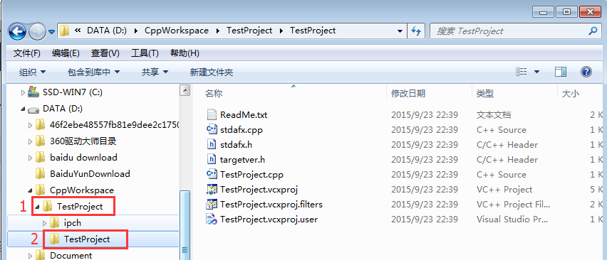

# 带你玩转 Visual Studio——带你新建一个工程

接着上一篇文章[带你玩转 Visual Studio——开篇介绍](http://blog.csdn.net/luoweifu/article/details/48664887)继续讲这个主题，现在我们从创建一个新的工程开始。

## 一步一步创建项目

1. 依次选择菜单：File\New\Project，打开 New Project 对话框。
2. <1>.选择项目类型：Win32 Console Application；<2>.填写工程名(Project Name):TestProject(可以给它取一个任意你想要的名字)；<3>.选择该工程存放的路径：D:\CppWorkspace。 


你可能会想问：列表里这么多工程类型，分别代表什么含义啊？ 这个问题后面再讨论，你先记住这张图。

1.点击 Ok ，然后点击 Next ，会出现这一步 


2. 我们就采用默认的设置，点击 Finish ，工程创建完成。 
（这是工程相关的设置，同样先不用管它，先记住这张图，后面再讨论）。

## 工程结构与目录结构

工程结构


创建完成之后，我们会在左侧看到这样一个工程结构。分别说明如下：
 
**External Dependencies：** 
工程的外部依赖文件，这个目录是 VS 自动生成的，你最好别动它。

**Header Files：** 
头文件，也就是 .h(.hpp) 后缀的头文件。

**Source Files：** 
源文件，也就 .cpp (或.c，针对 C 语言)后缀的文件。

**Header Files：** 
资源文件，如果你创建的是 MFC 的工程，*.rc 文件就会在这里。

工程结构的作用：

1. 方便管理，将不同类型或不同用途的文件配制在不同的结构下，方便文件的浏览、查找和代码的管理。

2. 工程结构的目录与真实文件的目录不一定相同。

3. 你可以根据文件的不同用途或不同含义，对工程结构重新配置。 
比如我觉得 Source Files 和 Header Files 这名太长，你可以选中它按 F2 ，分别把它改重命名成 Source 和 Header 。关于工程结构的自定义配置，后续章节的文章还会再提到。

目录结构



正如上面提到的“工程结构的目录与真实文件的目录不一定相同”，我们在文件管理器中打开 TestProject 所在的目录，可以看到 *.h 和 *.cpp 文件都在同一个目录下，在我的目录里也就是位于 D:\CppWorkspace\TestProject\TestProject。

##　写一个 HelloWorld 程序

所有计算机语言的学习都从 HelloWorld 开始， Ok，那我们也从 HelloWorld 开始写一个程序吧！在 TestProject.cpp 文件中写一 个 HelloWorld 程序如下：

```
#include "stdafx.h"

#include <iostream>

using namespace std;

int _tmain(int argc, _TCHAR* argv[])
{
    cout << "Hello World" << endl;
    return 0;
}
```

编译： 
右键工程名 TestProject 选择 Build ，或者点击菜单 Build\Build Project。 

运行： 
内容太简单，直接运行吧，按 Ctrl+F5 或点击菜单 Debug\Start Without Debugging。 


## 工程目录下各文件的含义

一般大部分的文章可能介绍到上面就算结束了，但我这还没有。创建工程产生的各个文件都你知道是什么用的吗？

如果你是一个初学者，你可能会不知道(老手请跳过本文)。Ok，我就带你逐一了解吧。
解决方案与工程

在这之前先了解一个概念：解决方案与工程。 
解决方案 ( Solution)：一个大型项目的整体的工作环境； 
工程 ( Project)：一个解决方案下的一个子工程；

在 VS 中，一个 Solution 可以有一个或多个 Project 。在我们创建一个工程时，如果没有指定 Solution ， VS 会帮我们创建一个与工程名相同的 Solution，这时一个 Solution 里只有一个 Project。所有在我们的 TestProject 的文件目录结构中 TestProject 文件夹下还有一个 TestProject 文件夹(如图 4)，第一个就是整个 Solution 的目录，第二个才是 Project 的目录。

解决方案相关的文件：

**TestProject.sln：** 
整个解决方案 ( Solution ) 的配制文件，组织多个工程和相关的元素到一个解决方案中。用鼠标双击它就能用 VS 打开整个工程项目。

**TestProject.sdf：** 
浏览相关的数据库文件，它支持浏览和导航的特性。如跳转到方法、变量的声明，查找所有对象的所有被引用的地方，类视图等等。

**TestProject.suo： **
(solution user opertion) 解决方案用户选项,记录所有将与解决方案建立关联的选项， 以便在每次打开时，它都包含您所做的自定义设置.

**TestProject.opensdf：** 
打开解决方案( Solution ) 时的临时文件，这个文件只有你的解决方案在 VS 打开的状态才会有，工程一关闭文件就被删除了。

工程相关的文件

**TestProject.vcxproj： **
记录工程( Project )相关的属性配制。

**TestProject.vcxproj.filters： **
文件过虑器，上图 3“工程结构”中各个文件的组织和编排都是定义在这个文件中的。如果由于某种特殊的原因(如系统或 VS 突然崩溃)导致你打开工程时文件的组织结构是乱的，100%就是这个文件的原因。

**TestProject.vcxproj.user： **
用户相关的一些配制。

上面这些文件中有几个比较重要的一定不能删的文件是： 
 TestProject.sln、TestProject.vcxproj、TestProject.vcxproj.filters

不要问我是怎样知道这些文件的作用的，请看官方文档： 
VS2010 定义：https://msdn.microsoft.com/en-us/library/3awe4781.aspx. 
VS2015 定义：https://msdn.microsoft.com/en-us/library/vstudio/hx0cxhaw(v=vs.110).aspx

当然有一些说明是需要经过项目的实践才能理解的。