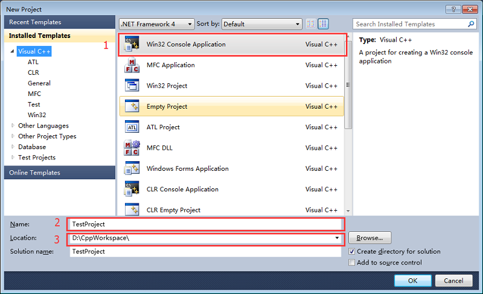

# 带你玩转Visual Studio——带你了解VC++各种类型的工程

上一篇文章带你玩转[Visual Studio——带你新建一个工程](http://blog.csdn.net/luoweifu/article/details/48692267)一文中提到新建一个工程时会有很多的工程类型(图1)，现在将简单介绍各种类型工程的含义和主要用途。由于这里包含的工程类型太多，有很多本人也没有接触过，有些可能理解的不太对的地方还请谅解。

首先说明一下，如果你的初学者或者 C++ 开发的时间不长，本篇文章的很多内容理解不了是正常的(我当初也不理解)。你可先有大概的概念，等工作(或有实际的项目开发经验)一两年后再回来看看也许就明白了。

## 理解几个概念

在开讲之前先大概理解几个概念，这是理解后面各种工程含义的基础。

**COM **

 COM (Component Object Model)组件对象模型是 microsoft 制定的一个组件软件标准，跟 unix 上的 CORBA 一样。凡是遵循 COM 标准开发出来的组件称为 COM 组件。目地是实现二进制方式的软件重用 。在 windows 平台上，COM的实现形式有 DLL (进程内组件)和 EXE (进程外组件)2种。

**OLE**

OLE(Object Linking and Embedding)对象连接与嵌入是微软的复合文档技术，可方便实现应用程序之间的通信。在后来的 OLE2 中才导入了 COM ，提供了对 COM 的支持，利用这种技术可开发可重复使用的软件组件 COM 。OLE 是软件比较早提出的一种技术。

** ATL **

ATL(Active Template Library) 活动模板库是一套 C++ 模板库，常用于开发 COM 程序和 ActiveX 程序。要理解 ATL 技术可从以下两方面理解： 
1. ATL 可以说是把 COM 封装了一下，象 MFC 一样做成一个库，并有一个向导，使COM应用开发尽可能地自动化、可视化，这就决定了 ATL 只面向 COM 开发提供支持。 
2. ATL 因其采用了特定的基本实现技术，摆脱了大量冗余代码，使用 ATL 开发出来的 COM 应用的代码简练高效。 
在 ATL 产生以前，开发 COM 组件的方法主要有两种：一是使用 COM SDK ( COM 软件开发包)直接开发 COM 组件，另一种方式是通过 MFC 提供的 COM 支持来实现。而现在  ATL 已经成为 Microsoft 支持 COM 应用开发的主要开发工具。

**MFC**

MFC(Microsoft Foundation Classes) 微软基础类是微软提供的一个用于 Windows 程序开发的基础类库。 MFC 以 C++ 类的形式封装了 Windows 的 API ，并且包含一个应用程序框架，以减少应用程序开发人员的工作量。其中包含的类包含大量 Windows 句柄封装类和很多 Windows 的内建控件和组件的封装类。

**ActiveX**

ActiveX 是微软提出的一组使用 COM 技术使得软件组件在网络环境中进行交互的技术集，它与具体的编程语言无关。作为针对 Internet 应用开发的技术，ActiveX 被广泛应用于WEB服务器以及客户端的各个方面。同时，ActiveX 技术也被用于方便地创建普通的桌面应用程序，此外 ActiveX 一般具有界面。

ActiveX 既包含服务器端技术，也包含客户端技术。其主要内容是： 
1. ActiveX控制（ActiveX Control）；用于向 WEB 页面、Microsoft Word 等支持 ActiveX 的容器（Container）中插入 COM 对象。  

2. ActiveX 文档（ActiveX Document）；用于在 WEB Browser 或者其它支持 ActiveX 的容器中浏览复合文档（非 HTML 文档），例如 Microsoft Word 文档，Microsoft Excel 文档或者用户自定义的文档等。 

3. ActiveX 脚本描述（ActiveX Scripting）；用于从客户端或者服务器端操纵 ActiveX 控制和 Java 程序，传递数据，协调它们之间的操作。 

4. ActiveX 服务器框架（ActiveX Server Framework）；提供了一系列针对 WEB 服务器应用程序设计各个方面的函数及其封装类，诸如服务器过滤器、HTML 数据流控制等。 
5. 在Internet Explorer 中内置 Java 虚拟机(Java Virtual Machine)，从而使 Java Applet 能够在Internet Explorer 上运行，并可以与 ActiveX 控制通过脚本描述语言进行通信。

**OLE、ActiveX、COM之间的区别**

从时间的角度讲，OLE 是最早出现的，然后是 COM 和 ActiveX ；从体系结构角度讲，OLE 和 ActiveX 是建立在  COM 之上的，所以 COM 是基础；单从名称角度讲，OLE、ActiveX 是两个商标名称，而 COM 则是一个纯技术名词，这也是大家更多的听说 ActiveX 和 OLE 的原因。既然OLE是最早出现的，那么就从 OLE 说起，自从 Windows 操作系统流行以来，“剪贴板”（ Clipboard ）首先解决了不同程序间的通信问题（由剪贴板作为数据交换中心，进行、粘贴的操作），但是剪贴板传递的都是“死”数据，应用程序开发者得自行编写、解析数据格式的代码，于是动态数据交换（Dynamic Data Exchange，DDE）的通信协定应运而生，它可以让应用程序之间自动获取彼此的最新数据，但是，解决彼此之间的“数据格式”转换仍然是程序员沉重的负担。对象的链接与嵌入（Object Linking and Embedded，OLE）的诞生把原来应用程序的数据交换提高到“对象交换”，这样程序间不但获得数据也同样获得彼此的应用程序对象，并且可以直接使用彼此的数据内容，其实 OLE 是 Microsoft 的复合文档技术，它的最初版本只是瞄准复合文档，但在后续版本OLE2中，导入了 COM 。由此可见，COM是应 OLE 的需求而诞生的，所以虽然 COM 是 OLE 的基础，但 OLE 的产生却在 COM 之前。 COM 的基本出发点是，让某个软件通过一个通用的机构为另一个软件提供服务。COM 是应 OLE 的需求而诞生，但它的第一个使用者却是 OLE2，所以 COM 与复合文档间并没有多大的关系，实际上，后来 COM 就作为与复合文档完全无关的技术，开始被广泛应用。这样一来， Microsoft 就开始“染指”通用平台技术。但是 COM 并不是产品，它需要一个商标名称。而那时 Microsoft 的市场专家们已经选用了 OLE 作为商标名称，所以使用 COM 技术的都开始贴上了 OLE 的标签，虽然这些技术中的绝大多数与复合文档没有关系。 
====本段内容转载自[《OLE、ActiveX、COM、ATL 联系与区别》](http://www.jeepshoe.org/804052511.htm)====

## 各种工程结构

**ATL**

ATL Project

创建一个基于 ATL 的工程，用ATL的方式进行 COM 组件的开发，ATL 提供了大量可重用的模板。ATL 可用于COM 组件的开发，也可用于 ActiveX 的开发。

**CLR**

Class Library

CLR Console Application

CLR Empty Project

Windows Forms Application

Windows Forms Control Library

CLR(Common Language Runtime )是公共语言运行库，和 Java 虚拟机一样也是一个运行时环境。CLR 的核心功能包括：内存管理、程序集加载、安全性、异常处理和线程同步，可由面向CLR的所有语言使用。并保证应用和底层操作系统之间必要的分离。 CLR/C++ 是托管的 C++ 程序，数据和代码是由 CLR 管理的，调用方不用管内存的分配和释放， CLR 好像常用于.net。

这一块我还真不了解，就不说了，怕误人子弟！！！

**General**

 Empty Project

就是创建一个空的工程，不给你添加任何.cpp 或.h 文件，不进行任何特殊的设置。

Custom Wizard

就是用户自定义向导，什么意思呢？比如你每次建一个新的工程时都期望这个工程中有 main.cpp、projectDescription.txt这两个文件，并且 main.cpp 中有一个默认的 main 函数。那么你可以建一个Custom Wizard 工程，并配制好 main.cpp、projectDescription.txt 文件及所在目录结构；然后你每次创建一个新的工程时选择都基于这个已有的 Custom Wizard 工程，新建的工程就有自动添加 main.cpp、projectDescription.txt 文件了。**说白了 Custom Wizard 就是一个模型，定义工程的默认文件和默认的配制。**

Makefile Project

makefile 就是对.cpp 和 .h 等文件的组织、构建、编译规则。这个在跨平台开发中会用到，如你开发的程序既要在 Windows下编译也要在 Linux、Mac 下编译，一般就会使用 makefile 的编译规则。说明 :Windows 下有一个微软自己的 NMake 构建器，因为在 VS下makefile 文件中的内容要符合 NMake 的规则才能够编译成功。

 **MFC**

MFC ActiveX Control

就是以支持 MFC 的方式创建 ActiveX 程序，可快速地开发带有界面的 ActiveX 程序。 
拓展阅读[《使用VS2010创建MFC ActiveX工程项目》](http://blog.csdn.net/longhuahaha/article/details/8556964)

MFC Application

这个就是你平常开发 MFC 程序时会用到的工程， MFC(Microsoft Foundation Classes) 是微软提供的一个用于 Windows 程序开发的基础类库，也是快速开发 Windows 上的桌面程序一般会选择的方式。

MFC DLL

它也是创建一个 MFC 的程序，与 MFC Application 的不同之处是：MFC Application 工程生成的是一个.exe的可执行文件，而 MFC DLL 工程生成的是一个.dll 的动态库文件。

## **Test**

Test

顾名思义，这就是一个测试工程，可用来进行单元测试、顺序测试、压力测试等。

**Win32**

Win32 Console Application

这个就是你最熟悉的控制台应用程序了，编译成功，运行时会出现一个黑色的命令行窗口。上篇文章带你玩转[Visual Studio——带你新建一个工程](http://blog.csdn.net/luoweifu/article/details/48692267)的样例也就是创建的这个类型的工程。

Win32 Project

MFC 其实是对 Windows API 进行的一种封闭，使其具有面向对象的特性。而这个 Win32 Project 工程就是以直接调用 Windows API 的方式，使用 Windows SDK 开发带有窗口界面的程序。

## 说明

其实，像一般的开发常用的工程类型也就几种： 
**Win32 Console Application**: 控制台应用程序，也是常见的那个黑色命令窗口。 
**Win32 Project**: 直接用 Windows API 进行 Windows 桌面应用程序的开发。 
**MFC Application**:  MFC 工程，用微软提供的类库进行界面程序的快速开发。