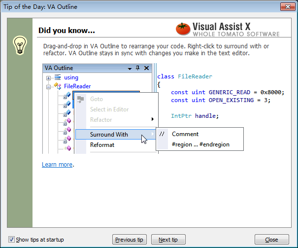
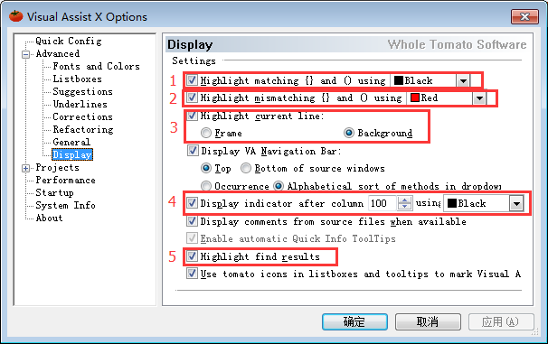

# 带你玩转 Visual Studio——带你高效开发

上一篇文章[带你玩转 Visual Studio——带你了解 VC++各种类型的工程](http://blog.csdn.net/luoweifu/article/details/48816605#t29)一文中讲了各种类型 VC++ 工程的主要功能和用途。现在将带你一起快速开发 c++程序。

有过 Java 开发经验的人都知道 Java 的常用开发工具(如 Eclipse、Intellij IDEA 等)都有非常强大的关键字高亮、智能提示、快速追踪等的功能。那也许你就要问了：进行 C++ 开发的 Visual Studio 是否也有这个功能呢？首先要说明的是 Visual Studio 本身并没有这么强大的功能(至少 VS2010 及之前版本是这样的，有一些简单的代码跟踪能力但是很难用)，但它有一个非常强大和好用的插件有这些功能，它就量 VassistX ，也称为 VC 助手，它就是本文要讲的内容。

## VassistX 的简单介绍与下载安装

简单介绍

VassistX 的全称是 Visual Assist X，是 whole tomato 开发的一个非常好用的插件，可用于 VC6.0 及 Visual Studio 的各个版本(包括 VS.NET2002、VS.NET2003、VS2005、VS2008、VS2010、VS2012、VS2013 及 VS2015 )。

VassistX 有以下主要功能： 
**智能提示**：关键字的提示，已有类名、方法名的提示，类成员(成员数据和成员函数)的提示； 
**代码高亮**：关键字、类名、方法名等用不同的颜色进行高亮，方便代码的阅读； 
**快速追踪**：声明与实现的快速跳转，.cpp 与.h 文件的快速切换； 
**高效查找**：文件名的查找，标识符的查找，标识符补引用的查找； 
**代码重构**：重命名标识符(变量名、方法名、类名等，这个非常有用)，自动添加成员变量的 Set/Get 方法，自动添加函数的注释等。

下载与安装

下载：

官方下载地址：http://www.wholetomato.com/downloads/default.asp 
你也可以到中文的一些网站去下载，网上一搜一大片。

安装：

安装非常简单，你只需要点击 VA_X_Setupxxxx.exe 进行默认安装即可，这没什么要说的。

注册码

还是那句话：自己想办法(以后都不再进行说明)，如果有钱还是支持正版，毕竟作为程序员的我们应该知道写一个好的程序不容易。

## VassistX 的使用指南

### 1.通过“Tip of the day”快速学习。

在你安装 VassistX 后，启动 VS 时，会有一个帮助提示(如下图)，这是你快速学习 VassistX 的最好方式，还有小动画提示，一看就懂。如果你看不懂英文，看小动画也能明白怎么回事。



如果你不希望每次启动 VS 时都弹出这个对话框，只需把左下角的 ”Show tips at startup” 的勾选去掉就可以。如果需要再次弹出对话，在菜单中选择 VassitX\Visual Assist X Option…–>Starup，把 Show tip of the day 勾选上即可。

### 2.主要窗口和工具

插件装上之后你应该就能感觉比以前好多了，比如代码高亮啊，智能提示啊，应该立马就能体现出来。但这还是要简单介绍一下。


插件成功安装之后，菜单栏会多一个 VassistX 的菜单，这里包含了 VassistX 的所有功能和相关的设置，设置方面后面还会进一步讲。 
左侧会有两个 VA Outline 和 VA View 视图(如果没有，可能菜单 VassistX\Tools\VA Outline 调出来)。VA Outline 这个视图很有用，也是我用的最多的一个视图，它能清晰地呈现一个类中的各个成员。 
工具栏也会多一个 VassistX 工具组。这个我用的最多的要数最右边的 .h 与.cpp 的切换按钮。
 
### 3.常用的快捷键

这里只列出一些最常用的快捷键，一般记住这些也就够用了。


更改快捷键

菜单 Tools\Option…，然后在打开的对话框中选择 Keyboard，Show commands containning 中输入 VAssistX 就能看到 VAssistX 的各种功能，你可以设置某一指定功能的快捷键。如你输入 VAssistX.refactorRename，就能看到重命名的默认快捷键是 Shift+Alt+R，你在 Press shortcut keys 中按下快捷键更改它。 


## VassistX 的高效开发的属性配制

选项设置

VassistX 有些默认设置并不太友好，我们可以自己重新设置它。在菜单中选择 VassitX\Visual Assist X Option…打开设置对话框。以下是我个人的偏好设置，仅作参考(只说明一些关键设置的含义)。


1. 拼写错误检测(这个不要选，不然老会有红色的波浪线提示)； 
2. 类型错误检测(这个选上，可以测试你的变量类型是否正确)；


1. 高亮引用的标识符(设置颜色，一个当前词的颜色，一个是非当前词的颜色)； 
2. 自动高亮当前光标所在处标识符 
3. 高亮查找引用的结果； 
4. 高亮重命名标识符时关联的变量；



1. (黑色)高亮匹配的括号； 
2. (红色)高亮不匹配的括号； 
3. 高亮当前光标所在的行(可选择高亮前景或高亮背景)； 
4. 纵向指示器的分隔线，一般用于控制一行代码的字符数； 
5. 高亮查找结果。

## 注释配制与自动添加代码

注释也是程序的一个重要组成部分之一，好的注释是提高代码的可读性和程序的可维护性的一个关键因素，而要写大量的注释是一件非常繁琐的事情，给程序员增加了不少负担，而 VAsssistX 就可能帮我们减轻这种负担。将光标移到函数名处，右键鼠标选择 Refactor\Document Method 可自动帮我们添加函数的注释。

我们可以自己配制自定义的注释格式。选择菜单：VAssistX\Insert VA Snippet…\Edit VA Snippet…进行设置。给出我的相关设置，仅作参考：

**Title**: File header detailed 
**Shortcut**: fh 
**Description**: 对整个文件进行注释
```
//===============================================================
//Summary:
//          $FILE_BASE$ 类， $end$
//FileName:
//          $FILE_BASE$.$FILE_EXT$
//Remarks:
//          ...
//Date:
//          $YEAR$/$MONTH$/$DAY$
//Author:
//          %USERNAME%(luoweifu@126.com)
//===============================================================
```
说明：两个$符号之间的内容都是 VAssistX 中定义的宏，参见文后的附录：[Visual Assist X Snippets 宏](http://blog.csdn.net/luoweifu/article/details/48852119#t15)

**Title**: Refactor Document Method 
**Shortcut**: 
**Description**: 对函数进行注释
```
//---------------------------------------------------------------
//function: 
//          $SymbolName$ $end$
//Access:
//          $SymbolVirtual$ $SymbolPrivileges$ $SymbolStatic$
//Parameter:
//          [in] $MethodArg$ - 
//Returns:
//          $SymbolType$ - 
//Remarks:
//          ...
//author:    %USERNAME%[luoweifu]
//---------------------------------------------------------------
```
**Title**: #ifndef … #endif 
**Shortcut**: #ifn 
**Description**: 防止头文件重复包含
```
#ifndef __$FILE_BASE_UPPER$_H__
#define __$FILE_BASE_UPPER$_H__
$end$
#endif  //__$FILE_BASE_UPPER$_H__
```

**Title:** Refactor Encapsulate Field 
**Shortcut: **
**Description:** 添加类中成员变量的 Get/Set 方法。
```
    $end$$SymbolType$ Get$GeneratedPropertyName$() const
    {
        return $SymbolName$;
    }
    void Set$GeneratedPropertyName$($SymbolType$ val)
    {
        $SymbolName$ = val;
    }
```

**Title: **
**Shortcut: **//- 
**Description: **用于某一个重要修改的注释，并记录修改时间。
```
//===============================================================
$end$
```

## 附录

Visual Assist X Snippets 宏

