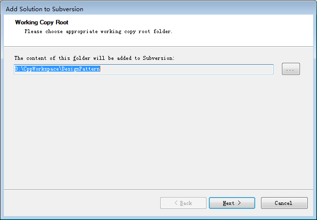
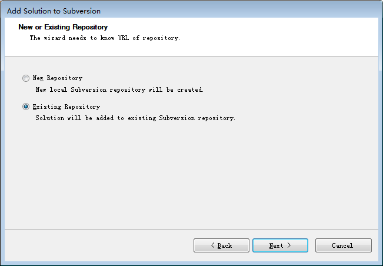
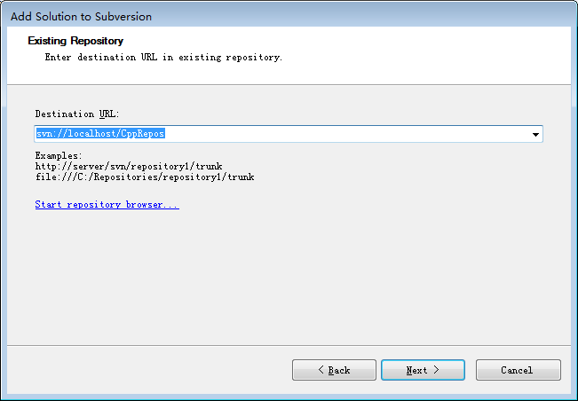
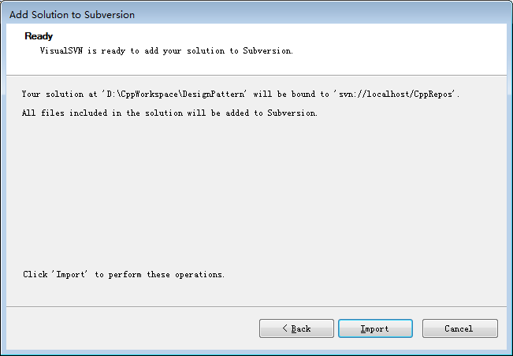
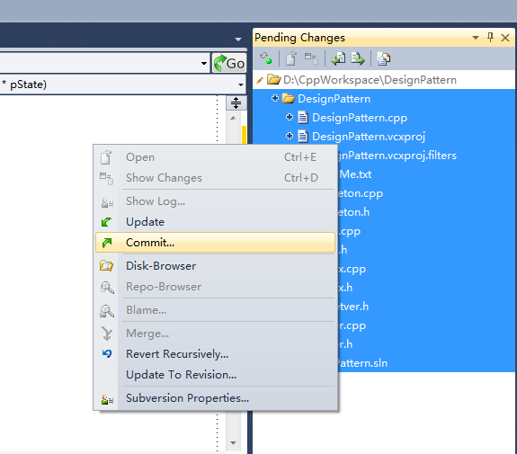
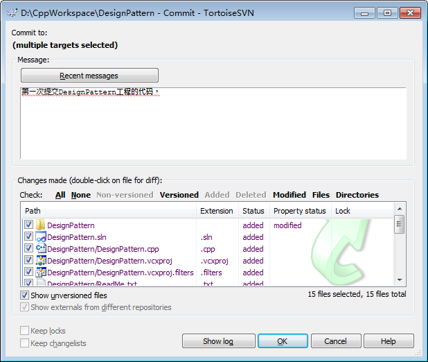
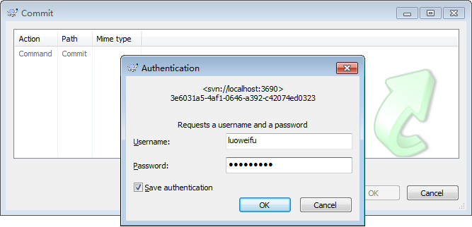
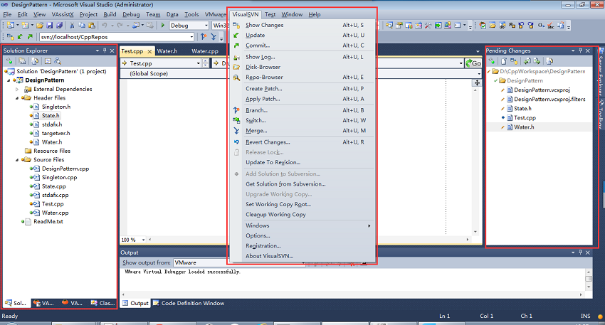
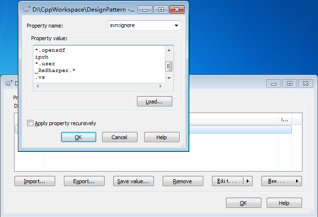

# 带你玩转 Visual Studio——带你高效管理代码

上一篇文章带你玩转 [Visual Studio——带你高效开发](http://blog.csdn.net/luoweifu/article/details/48852119) 通过对 VAssistX 优秀插件的讲解，让我们掌握了快速开发 C++ 代码的技能。然而大部分的程序都不是一个人的开发的，是由一个团队的多个人一起开发的，大型的系统还可能由多个不同的团队分包进行开发。多人进行协作开发时，代码的管理就显得及为重要，需要借助代码管理工具的辅助，这种工具又称为**版本控制系统**。

目前主流的版本控制系统有： 
**CVS**：是一个用于代码版本控制的自由软件，它是一个比较早出现的工具，由于它有很多自身的缺陷，现在几乎被 SVN 所取代了。 
`**SVN`：**SVN 是 Subversion 的简称，它是集中式的版本控制系统。SVN 继承了 CVS 的基本思想，包含了 CVS 的几乎所有功能。你可以认为 SVN 是 CVS 的升级版(但实际上它们完全是两个软件)。 
`**GIT`：**GIT 是分布式的版本控制系统。相信玩过开源代码的都知道 [github](https://github.com/)吧，它就是一个基于 git 的代码托管平台。 
关于 SVN 与 GIT 的区别，可参考：[GIT 和 SVN 之间的五个基本区别](http://www.vaikan.com/5-fundamental-differences-between-git-svn/)

**本文假设您已经对 SVN 有基本的了解和掌握，并用 TortoiseSVN 客户端进行过代码的迁入、选出、更新等功能进行团队的协作开发。如果没有这方面的知识，建议先查阅其它的相关资料，以对 SVN 有大致的了解后再来阅读本文。**

## VisualSVN 的简单介绍与下载安装

简介

VS2010 有一个自带的版本管理工具，也就是菜单中的 Team (团队协作)，但用过的人应该都知道非常难用，与 SVN 和 GIT 相比已经被甩出几条街了。 
所以很多的公司或团队会选择 SVN 来进行代码的管理，安装一个 SVN 的客户端进行的迁入与迁出。但可能很少人知道 VS 上还有一个插件可以帮助我们更好地使用 SVN，它就是**VisualSVN**。

VisualSVN 是一个用在 Visual Studio 上的插件，SVN 的客户端 TortoiseSVN(SVN 有一个服务器 Server 用于集中管理资源库，有一个客户端 Client 用于团队的每一个成员进行访问资源库、提交代码和迁出代码等。)是一个版本控制工具。VisualSVN 是基于 TortoiseSVN 的，也就是说 VisualSVN 要调用 TortoiseSVN 软件的功能，所以要使用 VisualSVN，必须同时安装 VisualSVN 和 TortoiseSVN。

下载

VisualSVN 的官方下载地址： 
https://www.visualsvn.com/visualsvn/download/ 
SVN 的官方下载地址： 
http://tortoisesvn.net/downloads.html 
**注意：**SVN 的版本要和 VisualSVN 的版本对应，也就是要下载给定的 VisualSVN 版本建议的 SVN 的版本。如 VisualSVN5.1.2 可用的 SVN 版本是 1.8.x、1.9.x，建议的 SVN 版本是 TortoiseSVN 1.9.2.

安装

安装这个很简单，一般先安装 TortoiseSVN 再安装 VisualSVN。选择默认的设置就可以，这个不多说了。

## VisualSVN 的常用功能介绍

向服务器上传一个工程

关于 SVN 环境的搭建是另外一个主题，你可以自己去查找相关的资料，这里只讲 VS 相关的东西。您也可以参考这篇文章：[Windows 下的 SVN 环境搭建详解](http://www.cnblogs.com/oyjt/p/3295801.html)，个人觉得写的还可以。要是在公司里一般会有已经搭建好的 SVN 环境，你只需要一个代码存放的地址。

现在假设你已经搭建好了 SVN 的环境，有一个 SVN 的工作地址：svn://localhost/CppRepos (这是我本 SVN 机服务器的库地址，远程服务器的地址也是一样的)，有一个 SVN 的用户名 (luoweifu) 和密码(svn_luoweifu)。现在要把本机 D:\CppWorkspace\DesignPattern 下的 DesignPattern 工程上传到服务器，以后在 VS2010 下开发这个工程并在 VS2010 提交和更新代码。基本的操作流程如下：

1.用 VS2010 打开 DesignPattern 工程。安装完 VisualSVN 插件后， VS 上会多一个菜单项 VisualSVN。

2.选择菜单 VisualSVN\Add Solution to Subversion…

3.选择要添加工程的本地路径，一般会自动给你设置好，如果路径是正确的就直接一步。 



4. 这里我们选择 Existing Repository，因为我们已经有一个 SVN 的地址，如果服务器没有创建对应的库可选择 New Repository 创建一个新的库。



5. 这里填入你的 SVN 的地址：svn://localhost/CppRepos 




6. 点击 Import 就可以了，这时你的 VS 会有一个 Pending Changes 的视图，如果没有可通过 View\Other Windows\Pending Changes 菜单调出来。这个视图将显示所有你要添加到服务器的文件。



7. Import 后只是将本地的文件与服务器上的地址做了映射，并没有真正将文件上传到服务器。你需要将所有文件提交(Commit)，才是真正上传到服务器。选中 Pending Changes 中的所有文件并右键 Commit。

 

8. 对话框的底部会显示你要提交的所有文件，你可以勾选要提交或不提交哪些文件。写上你提交的原因或备注(这个很重要，一定要有这样的习惯，以便后期查看历史记录时一看就能知道你做了什么)，然后点击 Ok 就可以了。 



9. 第一次提交会要求输入用户名和密码，输入你的 SVN 用户名和密码就可以了。

 

## VisualSVN 的主要功能

VisualSVN 有 TortoiseSVN 的几乎所有功能，它的作用就是将 TortoiseSVN 集成到 VS 中，这样代码的编码、代码的管理就可以都在一个 IDE 中进行，而不用每次提交或更新代码都要切换到 TortoiseSVN 去做。这跟 Java 的 MyEclipse、Intellij IDEA 的 SVN 插件是类似的。

添加 VisualSVN 插件后，VisualSVN 菜单会有 TortoiseSVN 的几乎所有功能。如将 Solution 添加到服务器，从服务器获得 Solution，更新代码、提交代码，打分支、合并分支等，如下图。这些功能只要你对 SVN 有大致的了解，模索模索就会用了，不再过多的介绍。

 


Pending Chages 视图将显示所有新添加、删除或被改动的文件。 
Solution Explorer 视图对不同状态的文件也会用不同颜色的圆点标注：绿色表示未做更改的文件，黄色表示已做改动或新添加的文件。

## C++工程上传服务器要忽视的文件

在带你玩转 Visual Studio ——带你新建一个工程一文中讲到了 C++ 工程中的各种类型文件，然后我们在代码的版本控制时有很多文件和目录并不需要上传到服务器。因为服务器中只需要存一些有用的数据和文件，一些无用的辅助性文件(如 pch 文件，Debug 目录等)只会给服务器和管理带来负担。这里将列出需要上传和不需要上传的文件类型。

需要上传的文件类型：

```
h: 头文件 
cpp: 源文件 
txt: 说明文件，如 readme 
rc: 资源文件 
rc2: 资源文件 
ico: 图标，如 logo 等 
sln: 解决方案工程文件 
vcxproj: 工程文件 
filters: 文件过虑器
```
不要上传的文件类型
```
Debug、Release 等编译结构目录 
ipch 目录 
aps: last resource editor state 
exe: build result 
idb: build state 
ipch: build helper 
lastbuildstate: build helper 
lib: build result. Can be 3rd party 
log: build log 
manifest: build helper. Can be written yourself. 
obj: build helper 
pch: build helper 
pdb: build result 
res: build helper 
sdf: intellisense dbase 
suo: solution user options 
tlog: build log 
user: debug settings. Do preserve if just one dev or custom debug settings
```

如果用 TortoiseSVN 进行管理，需要手动添加 ignore 属性将不需要上传的文件忽略掉。在你工程目录里，右键->TortoiseSVN->Properties->New->Other，弹出的对话框中 Property name 中选择 svn:ignore，Property value 中填入要忽略的内容(这里可以使用能配符)，如下图。



用 VisualSVN 进行上传 Solution 时，默认就帮你设置好了，将不需要的文件给屏蔽了。这也是 VisualSVN 的一大好处。