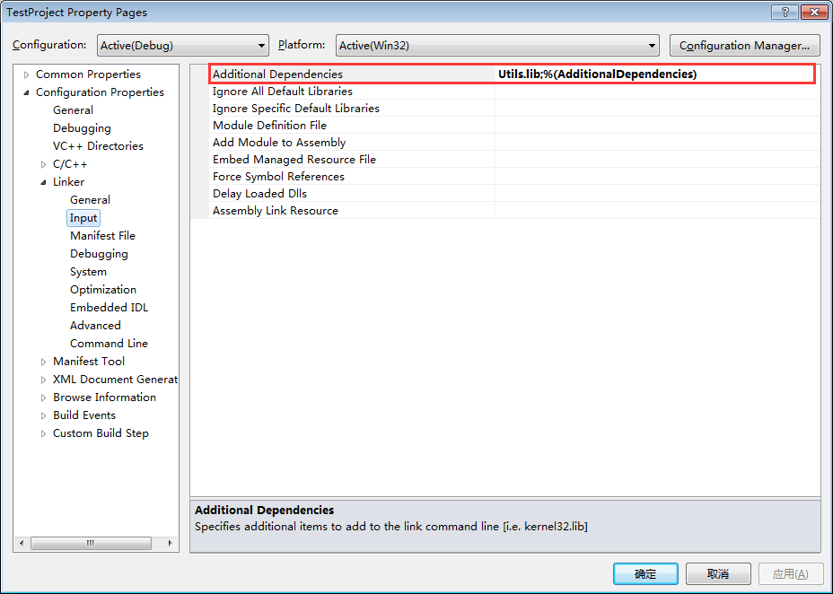

# 带你玩转 Visual Studio——带你发布自己的工程库

上一篇文章[带你玩转 Visual Studio——带你高效管理代码](http://blog.csdn.net/luoweifu/article/details/48866717)通过对 VisualSVN 优秀插件的讲解，让我们掌握了在集成开发环境 VS 中快捷高效地管理代码的技能。然而我们开发的程序并不总是直接地生成可执行的软件，我们可能只是开发某个大型系统的一个组件，也可能是开发某个软件的内核 SDK 提供给上层的应用程序调用，在开发的过程中我们也可能会用到第三方的开源库。那如果将自己的程序编译成程序库给调用方用呢？又如何在自己的程序中引用第三方库呢？这将是这篇文章要讲的内容——发布自己的工程库。

## 什么是程序库？

库是写好的现有的，成熟的，可以复用的代码。现实中每个程序都要依赖很多基础的底层库，不可能每个人的代码都从零开始，因此库的存在意义非同寻常。比如你经常使用的 STL (Standard Template Library)也是库，有了 STL 你才能方便地使用 std::string、std::cout 这些类。

本质上来说库是一种可执行代码的二进制形式，可以被操作系统载入内存，被别的程序调用执行。C++ 的库有两种：静态库和动态库。将一个程序编译成可执行文件一般经过 预编译–>编译–>链接 这几个过程，而静态库与动态库的区别主要体现在链接这个过程。

### 静态库：

在链接阶段，会将编译的目标文件.obj 与引用到的库.lib 一起链接打包到可执行文件 exe (也称为目标代码)中,程序运行时将不再需要该静态库。

因此最终链接成的可执行文件(.exe)体积较大。在 Windows 中一般以.lib 为后缀名，在 Linux 中一般以 .a 为后缀名。

### 动态库：

在链接阶段，动态库 .dll 并没有真正被连接到目标代码中，只是将这个动态库的声明链接到目标代码中(这样程序运行时才知道怎样使用这个动态库)，动态库.dll 依然是独立存在的，只有在程序运行是才会将.dll 载入到内存中被程序调用。因此程序运行时必须要有这个动态库且放在正确的路径中。

因此最终链接成的可执行文件 (.exe)** 体积较小**。在 Windows 中一般以.dll 为后缀名，在 Linux 中一般以.so 为后缀名。

### 静态库与动态库的区别：


## 编译自己的工程库

假设我们有这样一个工程，这个工程的作用就是提供一些常用的工具类和方法，然后我们要将这个工程编译成库提供给别人使用。

### 编译静态库

假设我们已经建好工程并写好了相应的代码：

 

*Utils.h:*

```
//===============================================================
//Summary:
//          Utils 类， 工具类
//FileName:
//          Utils.h
//Remarks:
//          ...
//Date:
//          2015/10/4
//Author:
//          Administrator(luoweifu@126.com)
//===============================================================

#ifndef __UTILS_H__
#define __UTILS_H__

#include <string>
#include <strstream>
//#include <cstdlib>

class Utils
{
public:
    Utils(void);
    ~Utils(void);

public:
    //---------------------------------------------------------------
    //function: 
    //          WString2String wstring 到 string 的转换
    //Access:
    //           public  
    //Parameter:
    //          [in] const std::wstring & ws - wstring 字符串
    //Returns:
    //          std::string - string 字符串
    //Remarks:
    //          些方法跨平台，可移植版本
    //author:   luoweifu
    //---------------------------------------------------------------
    static std::string WString2String(const std::wstring& ws);

    //---------------------------------------------------------------
    //function: 
    //          String2WString string 到 wstring 的转换
    //Access:
    //           public  
    //Parameter:
    //          [in] const std::string & s - string 字符串
    //Returns:
    //          std::wstring - wstring 字符串
    //Remarks:
    //          些方法跨平台，可移植版本
    //author:    luoweifu
    //---------------------------------------------------------------
    static std::wstring String2WString(const std::string& s);

};

//---------------------------------------------------------------
//function: 
//          ConvertToString 将 int 转换成 string
//Parameter:
//          [in] int val - 要转换的变量
//Returns:
//          std::string - 转换后的字符串
//Remarks:
//          ...
//author:   luoweifu
//---------------------------------------------------------------
std::string ConvertToString(int val);

#endif  //__UTILS_H__
```

上述声明的实现参考后面的附录[Utils.cpp](http://blog.csdn.net/luoweifu/article/details/48895765#t11)。 这里的注释是通过 VAssistX 生成的，关于 VAssistX 的用法可参考前面写的一篇文章[带你玩转 Visual Studio——带你高效开发](http://blog.csdn.net/luoweifu/article/details/48852119)。

要编译成静态库，我们可以这样设置我们的工程： 
右键工程 ->Properties 


然后右键 Build 就可以了，你可以在解决方案下的 Debug(实际的情况中一般要编译成 Release 版本，设置的方法一样，这里的内容后一章中再讲)目录下就能看到 Utils.lib，这就是编译出的库。要将这个库给别人使用，只要提供这个 Utils.lib 和这个工程的头文件就可以。将 Utils.h 拷贝到 D:\ReleaseLibs\StaticLib\Includes，将 Utils.lib 拷贝到 D:\ReleaseLibs\StaticLib\Libs，把 D:\ReleaseLibs\StaticLib 这个文件提供出去就可以了。静态库的使用请看后一小节[使用静态库](http://blog.csdn.net/luoweifu/article/details/48895765#t8)

### 编译动态库

与静态库相比，编译动态库要麻烦一些，一般要在导出函数的声明处加上 _declspec(dllexport) 关键字前缀。 
1.**Utils.h * 的声明如下
```
//===============================================================
//Summary:
//          Utils 类， 工具类
//FileName:
//          Utils.h
//Remarks:
//          ...
//Date:
//          2015/10/4
//Author:
//          Administrator(luoweifu@126.com)
//===============================================================

#ifndef __UTILS_H__
#define __UTILS_H__

#include <string>
#include <strstream>
//#include <cstdlib>

//===============================================================

//===============================================================

class Utils
{
public:
    Utils(void);
    ~Utils(void);

public:
    //---------------------------------------------------------------
    //function: 
    //          Max 获得两个数中的最大值
    //Access:
    //           public  
    //Parameter:
    //          [in] int nValue1 - 第一个数
    //          [in] int nValue2 - 每二个数
    //Returns:
    //          int - 最大值
    //Remarks:
    //          ...
    //author:   luoweifu
    //---------------------------------------------------------------
    static int Max(int nValue1, int nValue2);

    //---------------------------------------------------------------
    //function: 
    //          Min 获得两个数中的最小值
    //Access:
    //           public  
    //Parameter:
    //          [in] int nValue1 - 第一个值
    //          [in] int nValue2 - 第二个值
    //Returns:
    //          int - 最小值
    //Remarks:
    //          ...
    //author:   luoweifu
    //---------------------------------------------------------------
    static int Min(int nValue1, int nValue2);

    //---------------------------------------------------------------
    //function: 
    //          Range 将一值限定在一个范围内
    //Access:
    //           public  
    //Parameter:
    //          [in] int nMin - 最小值
    //          [in] int nMax - 最大值
    //Returns:
    //          int - 返回在限制在该范围内的一个值
    //Remarks:
    //          ...
    //author:   luoweifu
    //---------------------------------------------------------------
    static int Range(int nMin, int nMax, int nValue);
};


//---------------------------------------------------------------
//function: 
//          ConvertToInt 将一个常量字符串转换成 int 类型数据
//Access:
//           public  
//Parameter:
//          [in] const char * pStr - 常量字符串
//Returns:
//          int - 转换成的 int 值
//Remarks:
//          ...
//author:   luoweifu
//---------------------------------------------------------------
int ConvertToInt(const char* pStr);

#endif  //__UTILS_H__
```

1. 要编译成动态库，我们可以这样设置我们的工程： 
右键工程->Propertie


然后右键 Build 就可以了，你可以在解决方案下的 Debug (实际的情况中一般要编译成 Release 版本，设置的方法一样，这里的内容后一章中再讲)目录下就能看到 Utils.dll 和 Utils.lib，这就是编译出的库。要将这个库给别人使用，只要提供这个 Utils.dll、Utils.lib 和这个工程的头文件就可以。将 Utils.h 拷贝到 D:\ReleaseLibs\DynamicLib\Includes，将 Utils.dll 和 Utils.lib 拷贝到 D:\ReleaseLibs\DynamicLib\Libs，把 D:\ReleaseLibs\DynamicLib 这个文件提供出去就可以了。静态库的使用请看后一小节[使用动态库](http://blog.csdn.net/luoweifu/article/details/48895765#t9)

## 使用导入(第三方)库

在实际的开发中经常要用第三方提供的库，如开源库，或大型系统中合作方提供的组件。如果使用呢？我们就以上面自己制作的库为例进行讲解。假设我们有一个工程 TestProject 要使用上面自己制作的 Utils 库。

### 使用静态库

右键工程->Properties，进行如下的设置。 


设置头文件所在的路径


设置 lib 库所在的路径


设置要导入哪个 lib 库

2. 测试代码如下：

```
#include <iostream>
#include <tchar.h>
#include "Utils.h"

int _tmain(int argc, _TCHAR* argv[])
{
    int nMax = Utils::Max(25, 37);
    std::cout << nMax << std::endl;
    int nMin = Utils::Min(10, 44);
    std::cout << nMin << std::endl;
    int nValue = Utils::Range(0, 100, 115);
    std::cout << nValue << std::endl;
    char* pStr = "1234";
    int nValue2 = ConvertToInt(pStr);
    std::cout << nValue2 << std::endl;
    return 0;
}
```

### 使用动态库

1.右键 TestProject 工程->Properties，进行如下的设置。


设置头文件所在的路径  


设置 lib 库所在的路径 


设置要导入哪个导入库


2. 将 Utils.dll 放入与 TestProject 的输出文件 TestProject.exe 相同的路径下。这个很最重，不然会编译成功会是执行失败，因为找不到对应的 .dll 文件。

3. 测试代码与静态库的一样。

## 附录

### Utils.cpp

```
#include "Utils.h"

Utils::Utils(void)
{
}

Utils::~Utils(void)
{
}


int Utils::Max( int nValue1, int nValue2 )
{
    return nValue1 > nValue2 ? nValue1 : nValue2;
}

int Utils::Min( int nValue1, int nValue2 )
{
    return nValue1 < nValue2 ? nValue1 : nValue2;
}

int Utils::Range( int nMin, int nMax, int nValue )
{
    if (nMax < nMin)
    {
        int temp = nMin;
        nMin = nMax;
        nMax = temp;
    }

    if (nValue < nMin)
    {
        return nMin;
    } else if (nValue > nMax)
    {
        return nMax;
    } else
    {
        return nValue;
    }
}

int ConvertToInt( const char* pStr )
{
    int val;  
    std::strstream ss;  
    ss << pStr;  
    ss >> val;  
    return val;  
}
```
参考文章：[C++ 静态库与动态库](http://www.cnblogs.com/skynet/p/3372855.html)